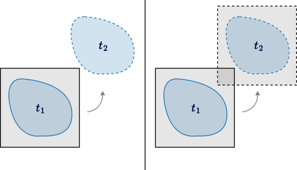
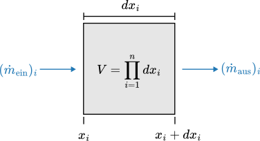
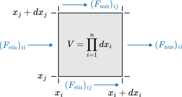
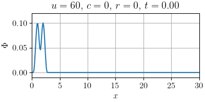
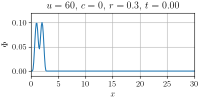

# Thema 1: Physikalische Grundlagen

Hier werden die für das Projekt relevanten Erhaltungsgleichungen hergeleitet. Außerdem wird die allgemeine Form einer Erhaltungsgleichung beschrieben. Das hier vermittelte Wissen dient dem besseren Verständnis für den Sachverhalt und dessen spätere Anwendung.

[TOC]

<!------------------------------------------------------------------------------
Vorbetrachtungen
------------------------------------------------------------------------------->
## Vorbetrachtungen

Die Formulierung der Gleichungen stützt sich auf der Kontinuumshypothese. Demnach befinden sich in einem hinreichend kleinen Fluidvolumen ausreichend viele Moleküle, sodass von einem Kontinuum ausgegangen werden kann. Etwas genauer lässt sich die Bedingung mit der Knudsen-Zahl `Kn` definieren, welche das Verhältnis der mittleren freien molekularen Weglänge _`l`_ zur charakteristischen Länge des Strömungsfeldes _`L`_ (z. B. dem Durchmesser eines durchströmten Rohres) beschreibt.

$$
    \mathrm{Kn} = \frac{l}{L}
$$

Für eine Kontinuumsströmung darf die Knudsen-Zahl nicht größer als ein Hundertstel sein.

> **Tabelle (Strömungsart nach Knudsen-Zahl)**
>
> 

Außerdem lässt sich eine Fluidströmung auf zwei unterschiedliche Weisen betrachten. Einerseits gibt es die Euler'sche Betrachtungsweise, bei der das Koordinatensystem ortsfest ist, und andererseits die Lagrange'sche Betrachtungsweise, bei der das Koordinatensystem mit der Strömung eines einzelnen Fluidpartikels mitgeführt wird. Nach dem klassischen Relativitätsprinzip kann man sich davon überzeugen, dass beide Betrachtungsweisen äquivalent sind. In der folgenden Abbildung ist links die Euler'sche und rechts die Lagrange'sche Betrachtungsweise mit der zeitlichen Entwicklung des Bezugssystems in schwarz und der des Fluidpartikels in blau dargestellt.

> **Abbildung (Euler'sche und Lagrange'sche Betrachtungsweise)**
>
> 

_**Anmerkung:** Da die Euler'sche Betrachtungsweise mit jedem beliebigen Inertialsystem in Einklang steht, ist sie womöglich etwas intuitiver als die Lagrange'sche. Darum wird im Folgenden auf diese Weise formuliert. Um ggf. von der Lagrange'schen zur Euler'schen Betrachtungsweise zu wechsel, wird die sog. substantielle Ableitung berechnet. In diesem Zusammenhang ist damit die totale Ableitung gemeint (der Name illustriert lediglich den Zusammenhang zum Bezugssystem des Fluidpartikels). Für die folgenden Betrachtungen sei außerdem noch erwähnt, dass der Geschwindigkeitsvektor in der numerischen Strömungsmechanik üblicher Weise mit **`u`** bezeichnet wird._

<!------------------------------------------------------------------------------
Massenerhaltung (alias Kontinuitätsgleichung)
------------------------------------------------------------------------------->
## Massenerhaltung (alias Kontinuitätsgleichung)

Für die Herleitung der Massenerhaltungsgleichung wird von einem infinitesimalen ortsfesten Kontrollvolumen _`V`_ ausgegangen. Dafür wird zunächst der Massenstrom über die einzelnen Raumachsen `1` bis _`n`_ bilanziert und anschließend aufsummiert, da es sich bei der Masse um eine skalare Größe handelt. Die eingeströmte Seite ist dabei diejenige, deren Flächennormale der positiven Achsenrichtung entgegenzeigt und die ausgeströmte Seite ist dementsprechend diejenige, deren Flächennormale in positive Achsenrichtung zeigt. Da der Massenstrom positiv ist, wenn dem Kontrollvolumen Masse zugeführt wird, geht der austretende Massenstrom mit negativem Vorzeichen in die Bilanz ein. Sollte sich der Massenstrom im Inneren des Kontrollvolumens (z. B. durch chemische Prozesse) ändern, dann muss außerdem noch ein Quellterm berücksichtigt werden. Quellen werden darin mit einem positiven Vorzeichen vermerkt und Senken mit einem negativen.

$$
    \partial_t m = \partial_t (\rho V) = \left[ \sum_{i=1}^n (\dot m_{\mathrm{ein}} - \dot m_{\mathrm{aus}})_i \right] + \dot m_{\mathrm{quell}} = \dot m
$$

> **Abbildung (Massenstrombilanz)**
>
> 

Der eintretende Massenstrom ergibt sich durch Multiplikation der Eintrittsfläche mit der senkrecht zu ihr stehenden Geschwindigkeitskomponente und der entsprechenden Fluiddichte.

$$
    (\dot m_{\mathrm{ein}})_i = \rho u_i V/dx_i
$$

Der austretende Massenstrom ergibt sich wiederum durch die Taylorreihe des eintretenden Massenstroms, entwickelt an der Eintrittsstelle und ausgewertet an der Austrittstelle.

$$
    (\dot m_{\mathrm{aus}})_i = [\rho u_i /dx_i + \partial_{x_i}(\rho u_i) + \mathcal{O}(dx_i)] V
$$

Außerdem seien keine Quellen oder Senken vorhanden.

$$
    \dot m_{\mathrm{quell}} = 0
$$

All diese Terme lassen sich nun in der Bilanzgleichung für den Massenstrom zusammenfassen.

$$
    \partial_t(\rho V) = -\sum_{i=1}^n [\partial_{x_i}(\rho u_i) + \mathcal{O}(dx_i)] V
$$

Da das Kontrollvolumen nach der Euler'schen Betrachtungsweise nicht von der Zeit abhängt, kann es aus der Gleichung rausgekürzt werden. Unter der Annahme, dass das Kontrollvolumen mit seiner Infinitesimalität gleichmäßig auf einen Punkt zusammenschrumpft

$$
    \forall i \in \{ 1,\ldots,n \}\colon~ \lim_{V\to 0} dx_i = 0
$$

entfallen glücklicher Weise die Terme höherer Ordnung.

$$
    \lim_{V\to 0} \partial_t \rho = -\sum_{i=1}^n \partial_{x_i}(\rho u_i)
$$

Übrig bleibt die Kontinuitätsgleichung in ihrer vollen Pracht

$$
    \partial_t \rho + \nabla\cdot (\rho \boldsymbol{u}) = 0,
$$

oder unter der Annahme von Inkompressibilität (wobei sich das Kontrollvolumen nicht mit dem Druck _`p`_ ändert und die Dichte _`ρ`_ konstant bleibt), d. h. in diesem Fall

$$
    \partial_p V = 0 ~\Leftrightarrow~ \rho = \text{konstant}
$$

und somit

$$
    \nabla\cdot \boldsymbol{u} = 0.
$$

<!------------------------------------------------------------------------------
Impulserhaltung (alias Navier-Stokes-Gleichung)
------------------------------------------------------------------------------->
## Impulserhaltung (alias Navier-Stokes-Gleichung)

Die Herleitung der Impulserhaltungsgleichung erfolgt analog. Somit wird hier der Impulsstrom bilanziert, was nach dem 2. Newton'schen Gesetz der Kraft entspricht. Im Gegensatz zur Masse, versteht sich der Impuls jedoch als vektorielle Größe, sodass ein Gleichungssystem von der Dimension des Raumes entsteht. Außerdem ist zu beachten, dass die Kraft nach Isaac Newton mit der Definition einer Punktmasse der Lagrange'schen Betrachtungsweise entspricht und die Geschwindigkeit daher zunächst substantiell abgeleitet werden muss, damit die Kraft im Euler'schen Sinne bilanziert werden kann. Ein- und austretende Kräfte sind i. d. R. Oberflächenkräfte, wohingegen Volumenkräfte wie die Schwerkraft in einem Quellterm subsumiert werden.

$$
    \boldsymbol{F} = m \boldsymbol{a} = (\rho V) (D_t \boldsymbol{u}) = \left[ \boldsymbol{F}_\mathrm{ein} - \boldsymbol{F}_\mathrm{aus} \right] + \boldsymbol{F}_\mathrm{quell}
$$

> **Abbildung (Kraftbilanz)**
>
> 

Bei den Oberflächenkräfte wird in Druck- und Spannungskräfte unterschieden. Die Druckkräfte wirken zentrisch auf das Kontrollvolumen und werden somit positiv bilanziert. Die Spannungskräfte hingegen wirken exzentrisch und werden demnach negativ bilanziert. Außerdem greifen die Spannungskräfte von allen Seiten an, wodurch die Gleichung erheblich an Komplexität gewinnt. Unter Berücksichtigung dessen lassen sich die eintretenden Kräfte wie folgt zusammenfassen.

$$
\begin{align*}
    (F_\mathrm{ein})_i &= \sum_{j=1}^n (F_\mathrm{ein})_{ij} \\
    &= \underbrace{pV/dx_i}_\text{Druckkräfte} - \underbrace{\sum_{j=1}^n \tau_{ij}V/dx_j}_\text{Spannungskräfte}
\end{align*}
$$

Für die austretenden Kräfte müssen die einzelnen Terme, wie zuvor bei dem austretenden Massenstrom, entlang der negativen Normalenrichtung ihrer Bezugsflächen mit einer Taylor-Reihe entwickelt werden.

$$
\begin{align*}
    (F_\mathrm{aus})_i &= \sum_{j=1}^n (F_\mathrm{aus})_{ij} \\
    &= [p/dx_i + \partial_{x_i}p + \mathcal{O}(dx_i)] V \\
    &\qquad - \sum_{j=1}^n [\tau_{ij}/dx_j + \partial_{x_j}\tau_{ij} + \mathcal{O}(dx_j)] V
\end{align*}
$$

Als Volumenkraft soll hier die Schwerkraft berücksichtigt werden.

$$
    (F_\mathrm{quell})_i = m g_i
$$

Alles zusammen kann nun in die Bilanzgleichung eingesetzt werden.

$$
    (\rho V) (D_t u_i) = - [\partial_{x_i}p + \mathcal{O}(dx_i)] V + \left\{ \sum_{j=1}^n [\partial_{x_j}\tau_{ij} + \mathcal{O}(dx_j)] V \right\} + (\rho V) g_i
$$

Anschließend wird durch die Masse geteilt. Die Terme höherer Ordnung verschwinden dann wiederum aufgrund der isotropen Infinitesimalität des Kontrollvolumens.

$$
    D_t u_i = - (\partial_{x_i}p)/\rho + \left( \sum_{j=1}^n \partial_{x_j}\tau_{ij} \right)/\rho + g_i
$$

Hier begegnet uns eine mögliche Form der Navier-Stokes-Gleichung.

$$
    D_t \boldsymbol{u} = -\nabla{p}/\rho + (\nabla\cdot\boldsymbol{\tau})/\rho + \boldsymbol{g}
$$

Um diese Gleichung für inkompressibile Newton'sche Fluide zu vereinfachen, kann der Stokes'sche Spannungsansatz

$$
    \boldsymbol{\tau} = \mu [ \nabla\boldsymbol{u} + (\nabla\boldsymbol{u})^\top ]
$$

mit den folgenden Identitäten herangezogen werden.

$$
\begin{align*}
    \nabla\cdot (\nabla\boldsymbol{u}) &= \nabla^2 \boldsymbol{u} \\
    \nabla\cdot (\nabla\boldsymbol{u})^\top &= \nabla(\nabla\cdot\boldsymbol{u}) \\
    \nabla\cdot\boldsymbol{u} &= 0 \\
    \mu &= \nu\rho
\end{align*}
$$

Wird dies in die Navier-Stokes-Gleichung eingesetzt, so ergibt sich

$$
    D_t \boldsymbol{u} = -\nabla{p}/\rho + \nu\nabla^2\boldsymbol{u} + \boldsymbol{g}
$$

und mit der substantiellen Ableitung

$$
\begin{align*}
    D_t\boldsymbol{u} &= (dt/dt)(\partial_t\boldsymbol{u}) + \sum_{i=1}^n \underbrace{(dx_i/dt)}_{u_i}(\partial_{x_i}\boldsymbol{u}) \\
    &= \partial_t\boldsymbol{u} + \left( \sum_{i=1}^n u_i \partial_{x_i} \right) \boldsymbol{u} \\
    &= \partial_t\boldsymbol{u} + (\boldsymbol{u}\cdot\nabla)\boldsymbol{u}
\end{align*}
$$

letztendlich

$$
    \partial_t\boldsymbol{u} + (\boldsymbol{u}\cdot\nabla)\boldsymbol{u} = -\nabla{p}/\rho + \nu\nabla^2\boldsymbol{u} + \boldsymbol{g}.
$$

<!------------------------------------------------------------------------------
Allgemeine Transportgleichung (alias Konvektions-Diffusions-Gleichung)
------------------------------------------------------------------------------->
## Allgemeine Transportgleichung (alias Konvektions-Diffusions-Gleichung)

Aus den beiden Herleitungen gehen gewisse Ähnlichkeiten hervor. Darum stellt sich die Frage, ob es nicht eine Art Blaupause für die Herleitung solcher Erhaltungsgleichungen gibt – und die gibt es in der Tat. Um dem Verständnis für die Erhaltungsgleichungen näher zu kommen, ist es durchaus von Vorteil, das Konzept einer solchen zu verallgemeinern. Dafür wird die Kontinuitätsgleichung für eine allgemeine Strömungsgröße _`Φ`_ mit Quellterm _`R`_ aufgestellt.

$$
    \partial_t \Phi + \nabla\cdot\boldsymbol{J} = R
$$

Dabei ist _**`J`**_ die Stromdichte, die den Fluss der Größe _`Φ`_ durch die Grenzflächen des Kontrollvolumens beschreibt. Die Stromdichte setzt sich aus zwei Anteilen zusammen:

- Dem Diffusionsanteil $$\boldsymbol{J}_\mathrm{diff} = -c\nabla\Phi,$$ welcher nach dem 1. Fick'schen Gesetz den Transport durch Diffusion beschreibt (als negativ proportional zum Konzentrationsgradienten, da die Stromdichte in Diffusionsrichtung abnimmt).

- Und dem Konvektionsanteil $$\boldsymbol{J}_\mathrm{konv} = \boldsymbol{u}\Phi,$$ welcher den Transport durch Konvektion beschreibt (als Produkt der Geschwindigkeit mit der Strömungsgröße).

Damit setzt sich die Stromdichte folgendermaßen zusammen.

$$
    \boldsymbol{J} = \boldsymbol{J}_\mathrm{diff} + \boldsymbol{J}_\mathrm{konv} = -c\nabla\Phi + \boldsymbol{u}\Phi
$$

Und es ergibt sich die Konvektions-Diffusions-Gleichung mit ihren unterschiedlichen Termen für Skalare

$$
    \underbrace{\partial_t \Phi}_\text{Instationarität} = \underbrace{c\nabla^2\Phi}_\text{Diffusion} - \underbrace{\nabla\cdot(\boldsymbol{u}\Phi)}_\text{Konvektion} + \underbrace{R}_\text{Quelle},
$$

bzw. für Vektoren

$$
    \underbrace{\partial_t \boldsymbol{\Phi}}_\text{Instationarität} = \underbrace{c\nabla^2\boldsymbol{\Phi}}_\text{Diffusion} - \underbrace{(\boldsymbol{u}\cdot\nabla)\boldsymbol{\Phi}}_\text{Konvektion} + \underbrace{\boldsymbol{R}}_\text{Quelle}.
$$

---
> **Aufgabe (Zuordnung der Terme)**
>
> Schaut euch noch einmal die Navier-Stokes-Gleichung an und vergleicht sie mit der allgemeinen Transportgleichung. Findet ihr die entsprechenden Terme?

---
> **Begleitmaterial (Transportgleichung 1d)**
>
>  
>
>  
>
>  
