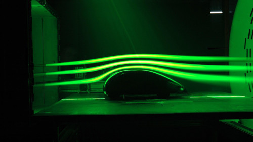
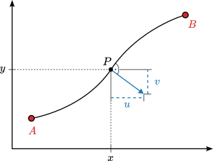

# Thema 2: Analytische Methodik

Hier werden Konzepte vorgestellt, die zur Lösung eines zweidimensionalen Strömungsproblems hilfreich sind. Über den Zusammenhang einzelner Strömungsgrößen lässt sich dann ein Lösungsalgorithmus formulieren.

[TOC]

<!------------------------------------------------------------------------------
Wirbeltransportgleichung
------------------------------------------------------------------------------->
## Wirbeltransportgleichung

Um Wirbelströmungen adäquat untersuchen zu können, wird der Transport einer ganz bestimmten Strömungsgröße betrachtet – nämlich der Wirbelstärke _**`ω`**_. Sie ist wie folgt definiert:

$$
    \boldsymbol{\omega} \coloneqq \operatorname{rot}(\boldsymbol{u}) = \nabla\times\boldsymbol{u}
$$

Für zweidimensionale Strömungen in der x-y-Ebene ist die Geschwindigkeit in z-Richtung null,

$$ u_z=0 $$

und die Wirbelstärke hat demzufolge nur eine Komponente in z-Richtung.

$$
    \omega_z = \partial_x u_y - \partial_y u_x
$$

Für die Herleitung der inkompressiblen Wirbeltransportgleichung

$$
    \partial_t\boldsymbol{\omega} + (\boldsymbol{u}\cdot\nabla)\boldsymbol{\omega} = (\boldsymbol{\omega}\cdot\nabla)\boldsymbol{u} + \nu\nabla^2\boldsymbol{\omega}
$$

wird die Rotation auf die inkompressible Navier-Stokes-Gleichung angewendet,

$$
    \nabla\times \left\{ \partial_t\boldsymbol{u} + (\boldsymbol{u}\cdot\nabla)\boldsymbol{u} \right\} = \nabla\times \left\{ -\nabla{p}/\rho + \nu\nabla^2\boldsymbol{u} + \boldsymbol{g} \right\}
$$

und es werden die folgenden Zusammenhänge einbezogen.

$$
\begin{align*}
    (\boldsymbol{u}\cdot\nabla)\boldsymbol{u} &=\nabla\boldsymbol{u}^2/2 -\boldsymbol{u}\times\boldsymbol{\omega} \\
    \nabla\times(\boldsymbol{u}\times\boldsymbol{\omega}) &= \boldsymbol{u}(\nabla\cdot\boldsymbol{\omega}) - \boldsymbol{\omega}(\nabla\cdot\boldsymbol{u}) + (\boldsymbol{\omega}\cdot\nabla)\boldsymbol{u} - (\boldsymbol{u}\cdot\nabla)\boldsymbol{\omega} \\
    \nabla\cdot\boldsymbol{\omega} = \nabla\cdot(\nabla\times\boldsymbol{u}) &= 0 \quad\text{(dreidimensionale Rotationsfelder sind divergenzfrei)} \\
    \nabla\times\nabla\phi &= \boldsymbol{0} \quad\text{(Gradientenfelder sind wirbelfrei)} \\
    \boldsymbol{F}_\mathrm{grav} &= m\boldsymbol{g} = -\nabla W_\mathrm{pot} \quad\text{(die Schwerkraft ist eine konservative Kraft)}
\end{align*}
$$

---
> **Aufgabe (Herleitung der Wirbeltransportgleichung)**
>
> Leitet die Wirbeltransportgleichung für inkompressible zweidimensionale Strömungen her.

---
> **Aufgabe (Zuordnung der Terme)**
>
> Vergleicht die soeben hergeleitete Wirbeltransportgleichung mit der allgemeinen Transportgleichung. Welche Terme finden sich in ihr wieder?

<!------------------------------------------------------------------------------
Stromlinien
------------------------------------------------------------------------------->
## Stromlinien

Ein wichtiges Konzept zur Visualisierung und Vereinfachung sind die Stromlinien. Sie sind diejenigen Kurven im Geschwindigkeitsfeld einer Strömung, deren Tangentenrichtung mit den Richtungen der Geschwindigkeitsvektoren übereinstimmen. In der folgenden Abbildung ist der Schlörwagen in einem Windkanal dargestellt, in dem Dampfturbinen die Stromlinien sichtbar machen. Bei stationärer Strömung entspricht der von einem Fluidpartikel zurückgelegte Weg einer Stromlinie.

> **Abbildung (Schlörwagen im Windkanal)**
>
> 
>
> _**Quelle:** Deutsches Zentrum für Luft- und Raumfahrt. Schlörwagen-Strömungsbild. <https://www.dlr.de/de/bilder/verkehr/schloerwagen-stroemungsbild>. (2011)_

Mathematisch ausgedrückt: Die Tangentialvektoren dieser Kurven verlaufen kollinear zum Vektorfeld der Geschwindigkeit.

$$
    d\boldsymbol{x}\times\boldsymbol{u} \overset{!}{=} \boldsymbol{0}
$$

Für dreidimensionale Strömungen folgt

$$
    \begin{bmatrix}dx\\dy\\dz\end{bmatrix}\times\begin{bmatrix}u\\v\\w\end{bmatrix} = \begin{bmatrix}dy \cdot w - dz \cdot v\\dz \cdot u - dx \cdot w\\dx \cdot v - dy \cdot u\end{bmatrix} \overset{!}{=} \begin{bmatrix}0\\0\\0\end{bmatrix}
$$

und somit

$$
\begin{gather*}
    \begin{cases}dy/v &=~~~ dz/w\\dz/w &=~~~ dx/u \\dx/u &=~~~ dy/v\end{cases} \\[20pt]
    ~~~\Updownarrow \\[5pt]
    dx/u = dy/v = dz/w
\end{gather*}
$$

bzw. für zweidimensionale Strömungen entsprechend

$$
    dx/u = dy/v.
$$

<!------------------------------------------------------------------------------
Stromfunktion
------------------------------------------------------------------------------->
## Stromfunktion

Um die Geschwindigkeit anhand der Stromlinien zu beschreiben, wird eine Stromfunktion _`Ψ`_ eingeführt, sodass die Stromlinien Niveaulinien dieser Stromfunktion darstellen. Entlang der Stromlinien ist dann die Stromfunktion konstant. Außerdem werden die Niveaustufen so festgelegt, dass ihre Differenz dem dazwischen passierenden Volumenstrom entspricht. Für inkompressible zweidimensionale Strömungen lässt die Stromfunktion als Differenz über ein bestimmtes Integral zwischen zwei Punkten _`A`_ und _`B`_ definieren.

$$
    \Psi(B) - \Psi(A) = \int_A^B (d\dot V_x - d\dot V_y) = \int_A^B (u\,dy - v\,dx)
$$

> **Abbildung (Definition der Stromfunktion)**
>
> 

Letztendlich handelt es sich dabei um eine Koordinatentransformation. Der Vorteil der Stromfunktion besteht darin, dass sie das Vektorfeld der Geschwindigkeit auf ein Skalarfeld reduziert.

<!------------------------------------------------------------------------------
Cauchy-Riemann-Gleichungen
------------------------------------------------------------------------------->
## Cauchy-Riemann-Gleichungen

Wie man sich vielleicht denken kann, ist die Definition der Stromfunktion kein Zufall. Für eine infinitesimale örtliche Differenz $dP = (dx,dy)$ entfällt das Integral.

$$
    d\Psi = u\,dy - v\,dx
$$

Und wird der so entstehende Ausdruck mit dem exakten Ortsdifferential

$$
    d\Psi = (\partial_x \Psi)dx + (\partial_y \Psi)dy
$$

verglichen, dann ist die Stromfunktion nun gerade die Lösung der Cauchy-Riemann-Gleichungen:

$$
    \begin{cases} \partial_x \Psi &= -v \\ \partial_y \Psi &= u \end{cases}
$$

Wohlgemerkt, erfüllt die Stromfunktion nach Konstruktion ebenso die inkompressible Kontinuitätsgleichung. (Hier wird im letzten Schritt der Satz von Schwarz angewendet.)

$$
    0 = \nabla\cdot\boldsymbol{u} = \partial_x u + \partial_y v = \partial_x(\partial_y\Psi) - \partial_y(\partial_x\Psi) = \partial_x\partial_y\Psi - \partial_x\partial_y\Psi = 0
$$

<!------------------------------------------------------------------------------
Poisson-Gleichung
------------------------------------------------------------------------------->
## Poisson-Gleichung

Auch die Wirbelstärke kann in einen direkten Zusammenhang mit der Stromfunktion gebracht werden, was sich später noch als sehr nützlich erweisen wird. Dafür gehen wir wieder von einer inkompressiblen zweidimensionalen Strömung aus,

$$
    \omega_z = \partial_x v - \partial_y u = - \partial_x (\partial_x \Psi) - \partial_y (\partial_y \Psi) = - (\partial_x^2 + \partial_y^2) \Psi = - \nabla^2 \Psi
$$

was uns zur Poisson-Gleichung führt.

$$
    \omega_z = - \nabla^2 \Psi
$$

<!------------------------------------------------------------------------------
Enstrophie
------------------------------------------------------------------------------->
## Enstrophie

Eine weitere Kenngröße, um Dissipationeffekte in möglicherweise turbulenten Strömungen zu untersuchen, ist die sog. Enstrophie. Bei inkompressiblen Strömungen stellt sie einen integralen Zusammenhang zwischen der Wirbelstärke und kinetischen Energie im Strömungsgebiet _`Ω`_ her.

$$
    \partial_t \underbrace{\left( \frac{\rho}{2} \int_\Omega \boldsymbol{u}^2 \,dV \right)}_{\eqqcolon\,\text{kinetische Energie}\,(E_\mathrm{kin})} = -\mu \underbrace{\left( \int_\Omega \boldsymbol{\omega}^2 \,dV \right)}_{\eqqcolon\,\text{Enstrophie}\,(\mathcal{E})}
$$

Das ist ein wirklich sehr beachtliches Resultat. Dadurch wird klar, dass die kinetische Energie über die Wirbelstärke und Viskosität des Fluids abgebaut (bzw. in Wärme umgesetzt) wird. Es eignet sich hervorragend zur physikalischen Validierung des numerischen Lösungsalgorithmus.

---

<b>Herleitung</b>

 

Wir gehen zunächst von der zeitlichen Änderung der kinetischen Energie aus. Hängt das Strömungsgebiet _`Ω`_ nach der Euler'schen Betrachtungsweise nicht von der Zeit ab, dann kann die Ableitung in das Integral gezogen und die Produktregel angewendet werden.

$$
    \partial_t E_\mathrm{kin} = \rho \int_\Omega \boldsymbol{u} \cdot \partial_t \boldsymbol{u} \;dV
$$

Für die zeitliche Änderung der Geschwindigkeit kann dann die Navier-Stokes-Gleichung eingesetzt werden.

$$
    \partial_t E_\mathrm{kin} = \rho \int_\Omega \boldsymbol{u} \cdot \left\{ -\boldsymbol{u}\cdot\nabla\boldsymbol{u} -\nabla{p}/\rho + \nu\nabla^2\boldsymbol{u} + \boldsymbol{g} \right\} \,dV
$$

Zur Umschreibung werden die folgenden Identitäten herangezogen.

$$
\begin{align*}
    \boldsymbol{u}\cdot(\boldsymbol{u}\cdot\nabla\boldsymbol{u}) &= \frac{1}{2}\boldsymbol{u}\cdot\nabla\boldsymbol{u}^2 = \frac{1}{2}\nabla\cdot\boldsymbol{u}^3 - \frac{1}{2}\boldsymbol{u}^2(\nabla\cdot\boldsymbol{u}) \\
    \boldsymbol{u}\cdot\nabla p &= \nabla\cdot(\boldsymbol{u} p) - p(\nabla\cdot\boldsymbol{u}) \\
    \boldsymbol{u}\cdot\boldsymbol{g} &= -\frac{1}{m}\boldsymbol{u}\cdot\nabla W_\mathrm{pot} = -\frac{1}{m}\nabla\cdot(\boldsymbol{u} W_\mathrm{pot}) + \frac{1}{m}W_\mathrm{pot}(\nabla\cdot\boldsymbol{u})
\end{align*}
$$

Für inkompressible Fluide vereinfachen sich diese aufgrund der Kontinuitätsgleichung.

$$
\begin{align*}
    \boldsymbol{u}\cdot(\boldsymbol{u}\cdot\nabla\boldsymbol{u}) &= \frac{1}{2}\nabla\cdot\boldsymbol{u}^3 \\
    \boldsymbol{u}\cdot\nabla p &= \nabla\cdot(\boldsymbol{u} p) \\
    \boldsymbol{u}\cdot\boldsymbol{g} &= -\frac{1}{m}\nabla\cdot(\boldsymbol{u} W_\mathrm{pot})
\end{align*}
$$

Daraus folgt

$$
    \partial_t E_\mathrm{kin} = \mu \int_\Omega \boldsymbol{u}\cdot\nabla^2\boldsymbol{u}\,dV - \int_\Omega \nabla\cdot \left[\left( \frac{\rho}{2}\boldsymbol{u}^2+p+\frac{\rho}{m}W_\mathrm{pot} \right)\boldsymbol{u}\right] \,dV,
$$

und mit dem Gauß'schen Integralsatz

$$
    \partial_t E_\mathrm{kin} + \oint_{\partial\Omega} \left( \frac{\rho}{2}\boldsymbol{u}^2+p+\frac{\rho}{m}W_\mathrm{pot} \right)\boldsymbol{u}\cdot\boldsymbol{n} \,dA = \mu \int_\Omega \boldsymbol{u}\cdot\nabla^2\boldsymbol{u}\,dV.
$$

Die einzelnen Terme dieser Gleichung lassen sich nun im Sinne der Gesamtenergieerhaltung identifizieren.

$$
    \partial_t E_\mathrm{kin} + \partial_t E_\mathrm{pot} = -\partial_t E_\mathrm{diss}
$$

Hängt die potentielle Energie nicht von der Zeit ab, dann verschwindet der Potentialstrom über die Grenzflächen und es folgt

$$
    \partial_t E_\mathrm{kin} = \mu \int_\Omega \boldsymbol{u}\cdot\nabla^2\boldsymbol{u}\,dV.
$$

Mit der Lagrange-Identität

$$
    \boldsymbol{\omega}^2 = (\nabla\times\boldsymbol{u})^2 = \nabla^2\boldsymbol{u}^2 - \boldsymbol{u}\cdot\nabla^2\boldsymbol{u},
$$

und inkompressiblen Kontinuitätsgleichung

$$
    \nabla^2\boldsymbol{u}^2 = \nabla\cdot\underbrace{(\nabla\cdot\boldsymbol{u})}_{=0}\cdot\boldsymbol{u},
$$

ergibt sich letztendlich der besagte Zusammenhang

$$
    \partial_t E_\mathrm{kin} = -\mu \int_\Omega \boldsymbol{\omega}^2\,dV.
$$

