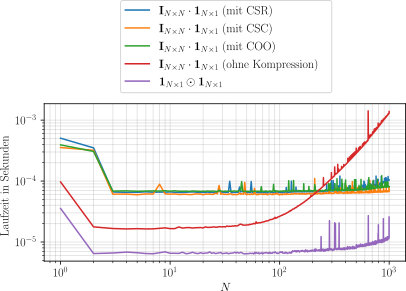

# Thema 3: Numerische Methodik

_... befindet sich in Arbeit ..._

[TOC]

<!------------------------------------------------------------------------------
Räumliche Diskretisierung
------------------------------------------------------------------------------->
## Räumliche Diskretisierung

Um ein zweidimensionales Gitter zu erstellen, werden zunächst die beiden Achsen einzeln diskretisiert und anschließend zu einer gemeinsamen Produktmenge verknüpft.

$$
\begin{align*}
    \Omega &\coloneqq X \times Y = \{(x,y) ~|~ x\in X, y\in Y\} \\
    &\Downarrow~\text{Diskretisierung} \\
    \boldsymbol{\Omega}_{ji} &~\widehat{=}~ (x_i,y_j)
\end{align*}
$$

Diese Produktmenge liegt dann als indizierbare Matrix vor. Die Reihenfolge der Achsen kann dabei prinzipiell beliebig festgelegt werden. Allerdings gibt es im Zweidimensionalen eine etwas sonderbare Konvention: Denn es wird zuerst die y-Achse und dann die x-Achse indiziert – also nicht chronologisch, wie es vielleicht zu vermuten wäre. Der Grund dafür ist, dass man sich die so entstehende Matrix in einem Koordinatensystem vorstellt.

> **Begleitmaterial (2d Gitter)**
>
>  
>
> 

<!------------------------------------------------------------------------------
Vektorisierung des Rechengitters
------------------------------------------------------------------------------->
## Vektorisierung des Rechengitters

Auf dem erstellten Gitter werden die strömungsmechanischen Gleichungen numerisch gelöst. Dies geschieht bei der Finiten-Differenzen-Methode in Vektorform, damit sich die Rechenoperationen über Matrizen abwickeln lassen. Um die Gleichungen in dieser Form lösen zu können, müssen die auf dem Gitter abgespeicherten Werte von einer Matrix in einen Vektor überführt werden. Je nachdem werden dafür entweder die Spalten oder Zeilen verkettet.

> **Begleitmaterial (Vektorisierung)**
>
>  
>
> 

<!------------------------------------------------------------------------------
Behandlung dünnbesetzter Matrizen
------------------------------------------------------------------------------->
## Behandlung dünnbesetzter Matrizen

Nach der Erstellung eines _`n×m`_-Gitters werden dessen Werte je nach Art der Vektorisierung über _`mn×mn`_- bzw. _`nm×nm`_-Matrizen abgebildet. Diese Matrizen sind bei der Finiten-Differenzen-Methode sehr groß und dünnbesetzt. Um die Laufzeit des Lösungsalgorithmus zu verbessern, macht es durchaus Sinn, diese dünnbesetzten Matrizen platzsparend zu speichern. Standardbibliotheken stellen dafür spezielle Datenstrukturen bereit.

In Matlab basiert die Implementierung für dünnbesetzte Matrizen auf dem CSC-Format:
- John Gilbert, Cleve Moler, Robert Schreiber. Sparse Matrices in MATLAB - Design and Implementation. <https://www.mathworks.com/help/pdf_doc/otherdocs/simax.pdf>. (1992)

In Python bietet [`scipy.sparse`](https://docs.scipy.org/doc/scipy/reference/sparse.html) ein Sammelsurium von unterschiedlichen Formaten (wie z. B. CSR, CSC und COO):
- SciPy Dokumentation. Sparse Arrays. <https://docs.scipy.org/doc/scipy/tutorial/sparse.html>

Weitere Informationen über die möglichen Formate dünnbesetzter Matrizen finden sich auch auf Wikipedia:
- Wikipedia Artikel. Sparse matrix. <https://en.wikipedia.org/wiki/Sparse_matrix>

<b>Vergleich der Laufzeit</b>

 

Hier lässt sich ein Vergleich der Laufzeit anstellen. Dafür können zwei Verfahren verwendet werden, die auch bei der algorithmischen Auslegung von Computerclustern eingesetzt werden:
- Bei dem sog. Strong-Scaling wird die Laufzeit für eine fixe Problemgröße mit zunehmender Anzahl von Prozessorkernen gemessen. Dieser Zusammenhang wird durch das Gesetz von Amdahl beschrieben.
- Bei dem sog. Weak-Scaling wird die Laufzeit für eine fixe Anzahl von Prozessorkernen mit zunehmender Problemgröße gemessen. Dieser Zusammenhang wird durch das Gesetz von Gustafson beschrieben.

In dieser Projektarbeit wird der Programmcode nicht parallelisiert, dennoch ist die Laufzeit gerade bei Skriptsprachen ein berechtigtes Bedenken. Denn im Gegensatz zur AOT-Kompilierung erfolgt die bei den Skriptsprachen verwendete JIT-Kompilierung während der Laufzeit, was die algorithmische Ausführung dementsprechend verlangsamt.

Als Beispiel für das Weak-Scaling wird hier die Laufzeit bei der Multiplikation einer Diagonalmatrix mit einem Vektor unter Verwendung unterschiedlicher Speicherformate gemessen. Das Ergebnis ist in jedem Fall das gleiche, nur die Laufzeit unterscheidet sich wesentlich.

$$
\underbrace{\mathbf{I}_{N \times N}\cdot\mathbf{1}_{N \times 1}}_\text{Rechenoperation mit Nullen} = \underbrace{\mathbf{1}_{N \times 1}\odot\mathbf{1}_{N \times 1}}_\text{Rechenoperation ohne Nullen} = \mathbf{1}_{N \times 1}
$$

> **Begleitmaterial (Vergleich der Laufzeit)**
>
>  
>
> 

<!------------------------------------------------------------------------------
Allgemeine Finite-Differenzen-Methode
------------------------------------------------------------------------------->
## Allgemeine Finite-Differenzen-Methode

...

<!------------------------------------------------------------------------------
Erstellung eindimensionaler Ableitungsmatrizen
------------------------------------------------------------------------------->
## Erstellung eindimensionaler Ableitungsmatrizen

...

<!------------------------------------------------------------------------------
Erstellung zweidimensionaler Ableitungsmatrizen
------------------------------------------------------------------------------->
## Erstellung zweidimensionaler Ableitungsmatrizen

...
