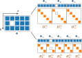

# Thema 3: Numerische Methodik

_... befindet sich in Arbeit ..._

[TOC]

<!------------------------------------------------------------------------------
Räumliche Diskretisierung
------------------------------------------------------------------------------->
## Räumliche Diskretisierung

Um ein zweidimensionales Gitter zu erstellen, werden zunächst die beiden Achsen einzeln diskretisiert und anschließend zu einer gemeinsamen Produktmenge verknüpft.

$$
\begin{align*}
    \Omega &\coloneqq X \times Y = \{(x,y) ~|~ x\in X, y\in Y\} \\
    &\Downarrow~\text{Diskretisierung} \\
    \boldsymbol{\Omega}_{ji} &~\widehat{=}~ (x_i,y_j)
\end{align*}
$$

Diese Produktmenge liegt dann als indizierbare Matrix vor. Die Reihenfolge der Achsen kann dabei prinzipiell beliebig festgelegt werden. Allerdings gibt es im Zweidimensionalen eine etwas sonderbare Konvention: Denn es wird zuerst die y-Achse und dann die x-Achse indiziert – also nicht chronologisch, wie es vielleicht zu vermuten wäre. Der Grund dafür ist, dass man sich die so entstehende Matrix in einem Koordinatensystem vorstellt.

---
> **Begleitmaterial (2d Gitter)**
>
>  
>
> 

<!------------------------------------------------------------------------------
Vektorisierung des Rechengitters
------------------------------------------------------------------------------->
## Vektorisierung des Rechengitters

Auf dem erstellten Gitter werden die strömungsmechanischen Gleichungen numerisch gelöst. Dies geschieht bei der Finiten-Differenzen-Methode in Vektorform, damit sich die Rechenoperationen über Matrizen abwickeln lassen. Um die Gleichungen in dieser Form lösen zu können, müssen die auf dem Gitter abgespeicherten Werte von einer Matrix in einen Vektor überführt werden. Je nachdem werden dafür entweder die Spalten oder Zeilen verkettet.

---
> **Begleitmaterial (Vektorisierung)**
>
>  
>
> 

<!------------------------------------------------------------------------------
Behandlung dünnbesetzter Matrizen
------------------------------------------------------------------------------->
## Behandlung dünnbesetzter Matrizen

Nach der Erstellung eines _`n×m`_-Gitters werden dessen Werte je nach Art der Vektorisierung über _`mn×mn`_- bzw. _`nm×nm`_-Matrizen abgebildet. Diese Matrizen sind bei der Finiten-Differenzen-Methode sehr groß und dünnbesetzt. Um die Laufzeit des Lösungsalgorithmus zu verbessern, macht es durchaus Sinn, diese dünnbesetzten Matrizen platzsparend zu speichern. Standardbibliotheken stellen dafür spezielle Datenstrukturen bereit.

In Matlab basiert die Implementierung für dünnbesetzte Matrizen auf dem CSC-Format:
- John Gilbert, Cleve Moler, Robert Schreiber. Sparse Matrices in MATLAB - Design and Implementation. <https://www.mathworks.com/help/pdf_doc/otherdocs/simax.pdf>. (1992)

In Python bietet [`scipy.sparse`](https://docs.scipy.org/doc/scipy/reference/sparse.html) ein Sammelsurium von unterschiedlichen Formaten (wie z. B. CSR, CSC und COO):
- SciPy Dokumentation. Sparse Arrays. <https://docs.scipy.org/doc/scipy/tutorial/sparse.html>

Weitere Informationen über die möglichen Formate dünnbesetzter Matrizen finden sich auch auf Wikipedia:
- Wikipedia Artikel. Sparse matrix. <https://en.wikipedia.org/wiki/Sparse_matrix>

---

<b>Vergleich der Laufzeit</b>

 

Hier lässt sich ein Vergleich der Laufzeit anstellen. Dafür können zwei Verfahren verwendet werden, die auch bei der algorithmischen Auslegung von Computerclustern eingesetzt werden:
- Bei dem sog. Strong-Scaling wird die Laufzeit für eine fixe Problemgröße mit zunehmender Anzahl von Prozessorkernen gemessen. Dieser Zusammenhang wird durch das Gesetz von Amdahl beschrieben.
- Bei dem sog. Weak-Scaling wird die Laufzeit für eine fixe Anzahl von Prozessorkernen mit zunehmender Problemgröße gemessen. Dieser Zusammenhang wird durch das Gesetz von Gustafson beschrieben.

In dieser Projektarbeit wird der Programmcode nicht parallelisiert, dennoch ist die Laufzeit gerade bei Skriptsprachen ein berechtigtes Bedenken. Denn im Gegensatz zur AOT-Kompilierung erfolgt die bei den Skriptsprachen verwendete JIT-Kompilierung während der Laufzeit, was die algorithmische Ausführung dementsprechend verlangsamt.

Als Beispiel für das Weak-Scaling wird hier die Laufzeit bei der Multiplikation einer Diagonalmatrix mit einem Vektor unter Verwendung unterschiedlicher Speicherformate gemessen. Das Ergebnis ist in jedem Fall das gleiche, nur die Laufzeit unterscheidet sich wesentlich.

$$
\underbrace{\mathbf{I}_{N \times N}\cdot\mathbf{1}_{N \times 1}}_\text{Rechenoperation mit Nullen} = \underbrace{\mathbf{1}_{N \times 1}\odot\mathbf{1}_{N \times 1}}_\text{Rechenoperation ohne Nullen} = \mathbf{1}_{N \times 1}
$$

> **Begleitmaterial (Vergleich der Laufzeit)**
>
>  
>
> 

<!------------------------------------------------------------------------------
Allgemeine Finite-Differenzen-Methode
------------------------------------------------------------------------------->
## Allgemeine Finite-Differenzen-Methode

Das Ziel einer jeden finiten Differenz ist es – basiert auf einem Schema, welches auf bestimmte Stützstellen vor- und zurückgreift – eine Ableitung zu approximieren. Dafür wird der Wert der abzuleitenden Funktion _`Φ`_ an der jeweiligen Stelle, sowie den _`l`_ Stellen links und den _`r`_ Stellen rechts davon durch Koeffizienten _`α`_ gewichtet und anschließend aufsummiert. Die Koeffizienten des Differenzenschemas leiten sich dabei aus der Taylor-Reihenentwicklung ab. Ist die Schrittweite _`h`_ äquidistant, dann lässt sich ihre entsprechende Potenz als Reziproke aus dem Differenzenschema faktorisieren.

$$
\partial_x^k \Phi_i = \frac{1}{h_x^k} \sum_{j=-l}^{r} \alpha_j \Phi_{i+j}
$$

> **Abbildung (Differenzenschema)**
>
> 

Die Taylor-Reihenentwicklung ist somit gegeben durch

$$
\Phi_{i+j} = \left[ \sum_{p=0}^{l+r} (\partial_x^p \Phi_i) (j h_x)^p / p! \right] + \mathcal{O}(h_x^{l+r+1}),
$$

wobei bis zur Ordnung _`l+r+1`_ entwickelt wird, da dies der Anzahl von Stützstellen entspricht und damit auch der Größe des, für die Koeffizienten _`α`_, zu lösenden Gleichungssystems. Der Ausdruck für die Reihenentwicklung lässt sich sodann in das Differenzenschema einsetzen.

$$
\partial_x^k \Phi_i = \frac{1}{h_x^k} \sum_{j=-l}^{r} \alpha_j \left\{ \left[ \sum_{p=0}^{l+r} (\partial_x^p \Phi_i) (j h_x)^p / p! \right] + \mathcal{O}(h_x^{l+r+1}) \right\}
$$

Die Summen können vertauscht werden und der Ordnungsterm reduziert sich durch das Reziproke der Schrittweitenpotenz.

$$
\partial_x^k \Phi_i = \frac{1}{h_x^k} \left[ \sum_{p=0}^{l+r} \sum_{j=-l}^{r} \alpha_j (\partial_x^p \Phi_i) (j h_x)^p / p! \right] + \mathcal{O}(h_x^{l+r+1-k})
$$

Um aus der Vorschrift ein Gleichungssystem abzuleiten, wird die äußere Summe mit _`p=k`_ und _`p≠k`_ aufgespalten.

$$
\partial_x^k \Phi_i = \underbrace{\left[ \sum_{j=-l}^{r} j^k \alpha_j / k! \right]}_{\stackrel{!}{=}1} \partial_x^k \Phi_i
+ \sum_{\substack{p = 0 \\ p \ne k}}^{l+r} h_x^{p-k} \underbrace{\left[ \sum_{j=-l}^{r} j^p \alpha_j / p! \right]}_{\stackrel{!}{=}0} \partial_x^p \Phi_i
+ \mathcal{O}(h_x^{l+r+1-k})
$$

Damit die Vorschrift konsistent ist, muss der Ausdruck in der ersten Klammer 1 und in der zweiten Klammer 0 ergeben, sodass sich für die Koeffizienten folgendes Gleichungssystem ergibt:

$$
\forall p \in \{ 0,\ldots,l+r \} \ni k\colon\quad \sum_{j=-l}^{r} j^p \alpha_j = \delta_{kp} p!
$$

Daraus lässt sich ein beliebiges Differenzenschema für die _`k`_-te Ableitung mit der Fehlerordnung _`l+r+1-k`_ konstruieren. Die Ableitungsordnung muss dabei nur kleiner sein als die Anzahl von Stützstellen.

---
> **Aufgabe (Differenzenschema)**
>
> Schreibt ein Programm, welches mit _`l≥0`_, _`r≥0`_ und _`0<k≤l+r`_ die Koeffizienten des Differenzenschemas für die _`k`_-te Ableitung berechnet.

<!------------------------------------------------------------------------------
Erstellung eindimensionaler Ableitungsmatrizen
------------------------------------------------------------------------------->
## Erstellung eindimensionaler Ableitungsmatrizen

Sind die Werte der Funktion und die Koeffizienten des Differenzenschemas an den Stützstellen bekannt, so kann die _`k`_-te Ableitung der Funktion approximiert werden. Im Eindimensionalen entspricht diese Ableitung ebenjenen Differenzenschema, angewendet auf die einzelnen Stützstellen.

$$
\partial_x^k \boldsymbol{\Phi}_{N\times{1}} \approx \begin{bmatrix}\rule[.5ex]{2.5ex}{0.5pt}&(\boldsymbol{d}_{x_1}^{(k)})_{1\times{N}}&\rule[.5ex]{2.5ex}{0.5pt}\\&\vdots&\\\rule[.5ex]{2.5ex}{0.5pt}&(\boldsymbol{d}_{x_N}^{(k)})_{1\times{N}}&\rule[.5ex]{2.5ex}{0.5pt}\end{bmatrix} \cdot \begin{bmatrix}\Phi_{x_1}\\\vdots\\\Phi_{x_N}\end{bmatrix} \eqqcolon (\boldsymbol{D}_x^{(k)})_{N\times{N}} \cdot \boldsymbol{\Phi}_{N\times{1}}
$$

---
> **Aufgabe (Ableitung 1d)**
>
> Schreibt ein Programm, welches die erste Ableitung von _`sin(x)`_ mit der Zentraldifferenz _`l=r=1`_ berechnet und vergleicht das Ergebnis mit der analytischen Lösung. Welche Fehlerordnung hat dieses Ableitungsverfahren?

<!------------------------------------------------------------------------------
Erstellung zweidimensionaler Ableitungsmatrizen
------------------------------------------------------------------------------->
## Erstellung zweidimensionaler Ableitungsmatrizen

Im Zweidimensionalen wird das Skalarfeld ebenso über ein Gitter diskretisiert, nur dass diesmal die Werte zunächst eine Matrix und keinen Vektor bilden. Für die Handhabung mittels Finiter-Differenzen-Methode ist das jedoch etwas unpraktisch, da so für die partiellen Ableitungen zwei unterschiedliche Dualräume entstehen.

Wenn die Zeilen den diskreten _`y`_-Werten und die Spalten den diskreten _`x`_-Werten entsprechen, dann wird das Skalarfeld für die _`k`_-te partielle Ableitung nach _`x`_ in den Zeilenraum der Differenzenmatrix abgebildet. Dabei ist zu beachten, dass diese Matrix im Vergleich zum Eindimensionalen transponiert ist.

$$
\partial_x^k \boldsymbol{\Phi}_{n\times{m}} &\approx \begin{bmatrix}\rule[.5ex]{2.5ex}{0.5pt}&(\boldsymbol{\Phi}_{y_1})_{1\times{m}}&\rule[.5ex]{2.5ex}{0.5pt}\\&\vdots&\\\rule[.5ex]{2.5ex}{0.5pt}&(\boldsymbol{\Phi}_{y_n})_{1\times{m}}&\rule[.5ex]{2.5ex}{0.5pt}\end{bmatrix} \cdot \begin{bmatrix}\rule[-1ex]{0.5pt}{2.5ex}&&\rule[-1ex]{0.5pt}{2.5ex}\\(\boldsymbol{d}_{x_1}^{(k)})_{m\times{1}}&\cdots&(\boldsymbol{d}_{x_m}^{(k)})_{m\times{1}}\\\rule[-1ex]{0.5pt}{2.5ex}&&\rule[-1ex]{0.5pt}{2.5ex}\end{bmatrix} \eqqcolon \boldsymbol{\Phi}_{n\times{m}} \cdot (\boldsymbol{D}_x^{(k)})_{m\times{m}}^\top
$$

Für die _`k`_-te partielle Ableitung nach _`y`_ erfolgt die Abbildung dementsprechend in den Spaltenraum der Differenzenmatrix, so wie es auch im Eindimensionalen bewerkstelligt wurde.

$$
\partial_y^k \boldsymbol{\Phi}_{n\times{m}} &\approx \begin{bmatrix}\rule[.5ex]{2.5ex}{0.5pt}&(\boldsymbol{d}_{y_1}^{(k)})_{1\times{n}}&\rule[.5ex]{2.5ex}{0.5pt}\\&\vdots&\\\rule[.5ex]{2.5ex}{0.5pt}&(\boldsymbol{d}_{y_n}^{(k)})_{1\times{n}}&\rule[.5ex]{2.5ex}{0.5pt}\end{bmatrix} \cdot \begin{bmatrix}\rule[-1ex]{0.5pt}{2.5ex}&&\rule[-1ex]{0.5pt}{2.5ex}\\(\boldsymbol{\Phi}_{x_1})_{n\times{1}}&\cdots&(\boldsymbol{\Phi}_{x_m})_{n\times{1}}\\\rule[-1ex]{0.5pt}{2.5ex}&&\rule[-1ex]{0.5pt}{2.5ex}\end{bmatrix} \eqqcolon (\boldsymbol{D}_y^{(k)})_{n\times{n}} \cdot \boldsymbol{\Phi}_{n\times{m}}
$$

Es ist anzumerken, dass bei dieser Approximation der partiellen Ableitungen immer das selbe Differenzenschema auf alle Stützstellen angewendet wird. Außerdem stellt sich heraus, dass die Rechnung sehr viel übersichtlicher wird, wenn das zweidimensionale Gitter vektorisiert ist. So können die beiden partiellen Ableitungen in ein und denselben Vektorraum abgebildet werden.

---

<b>Ableitung bei Spaltenverkettung [Matlab]</b>

 

Werden bei der Vektorisierung die Spalten verkettet – so wie in Matlab üblich – dann lassen sich die partiellen Ableitungen mittels Kronecker-Produkt ([_`kron`_](https://de.mathworks.com/help/matlab/ref/kron.html)) wie folgt schreiben:

$$
\begin{align*}
\partial_x^k \boldsymbol{\Phi}_{mn\times{1}} &\approx \underbrace{\left[(\boldsymbol{D}_x^{(k)})_{m\times{m}} \otimes \boldsymbol{I}_{n\times{n}}\right]}_{\eqqcolon(\boldsymbol{D}_x^{(k)})_{mn\times{mn}}} \cdot \boldsymbol{\Phi}_{mn\times{1}} \\[10pt]
\partial_y^k \boldsymbol{\Phi}_{mn\times{1}} &\approx \underbrace{\left[\boldsymbol{I}_{m\times{m}} \otimes (\boldsymbol{D}_y^{(k)})_{n\times{n}}\right]}_{\eqqcolon(\boldsymbol{D}_y^{(k)})_{mn\times{mn}}} \cdot \boldsymbol{\Phi}_{mn\times{1}}
\end{align*}
$$

Die partiellen Ableitungen werden dabei, wie zuvor, jeweils über die Stützstellen berechnet, an denen sich die andere Koordinate nicht verändert, und es wird immer das selbe Differenzenschema angewendet. Wenn die Topologie des Strömungsgebiets jedoch komplizierter ist, dann reicht es womöglich nicht mehr aus alle Stützstellen gleich zu behandeln, sodass der Ausdruck mit dem Kronecker-Produkt individuell auf das Strömungsgebiet angepasst werden muss, damit das Differenzenschema auch auf den Rändern des Strömungsgebiets konsistent ist.

Unter Umständen ist das Strömungsgebiet nicht einfach zusammenhängend und enthält beispielsweise ein Hindernis. Die nachfolgende Abbildung soll diesen Sachverhalt veranschaulichen, wobei die Auflösung für den Demonstrationszweck reduziert ist und für eine praktikable Anwendung eigentlich erhöht werden müsste, damit zwischen den Rändern des Strömungsgebiets genügend Platz für konsistente Differenzenschema vorhanden ist.

> **Abbildung (2d Ableitung mit Hindernis)**
>
> 

In diesem Fall müssen die Ableitungsmatrizen aus individuellen Blöcken zusammengesetzt werden.

$$
\begin{gather*}
\forall{i,j}\in\{1,\ldots,5\}\colon\quad (\boldsymbol{D}_{x}^{(k)})_{ij} \coloneqq \begin{bmatrix}(\boldsymbol{D}_{x_1}^{(k)})_{ij}&&\\&(\boldsymbol{D}_{x_2}^{(k)})_{ij}&\\&&(\boldsymbol{D}_{x_3}^{(k)})_{ij}\end{bmatrix} \\[10pt]
\boldsymbol{D}_x^{(k)} \coloneqq \begin{bmatrix}(\boldsymbol{D}_{x}^{(k)})_{11}&(\boldsymbol{D}_{x}^{(k)})_{12}&(\boldsymbol{D}_{x}^{(k)})_{13}&(\boldsymbol{D}_{x}^{(k)})_{14}&(\boldsymbol{D}_{x}^{(k)})_{15}\\(\boldsymbol{D}_{x}^{(k)})_{21}&(\boldsymbol{D}_{x}^{(k)})_{22}&(\boldsymbol{D}_{x}^{(k)})_{23}&(\boldsymbol{D}_{x}^{(k)})_{24}&(\boldsymbol{D}_{x}^{(k)})_{25}\\(\boldsymbol{D}_{x}^{(k)})_{31}&(\boldsymbol{D}_{x}^{(k)})_{32}&(\boldsymbol{D}_{x}^{(k)})_{33}&(\boldsymbol{D}_{x}^{(k)})_{34}&(\boldsymbol{D}_{x}^{(k)})_{35}\\(\boldsymbol{D}_{x}^{(k)})_{41}&(\boldsymbol{D}_{x}^{(k)})_{42}&(\boldsymbol{D}_{x}^{(k)})_{43}&(\boldsymbol{D}_{x}^{(k)})_{44}&(\boldsymbol{D}_{x}^{(k)})_{45}\\(\boldsymbol{D}_{x}^{(k)})_{51}&(\boldsymbol{D}_{x}^{(k)})_{52}&(\boldsymbol{D}_{x}^{(k)})_{53}&(\boldsymbol{D}_{x}^{(k)})_{54}&(\boldsymbol{D}_{x}^{(k)})_{55}\end{bmatrix},\quad
\boldsymbol{D}_y^{(k)} \coloneqq \begin{bmatrix}\boldsymbol{D}_{y_1}^{(k)}&&&&\\&\boldsymbol{D}_{y_2}^{(k)}&&&\\&&\boldsymbol{D}_{y_3}^{(k)}&&\\&&&\boldsymbol{D}_{y_4}^{(k)}&\\&&&&\boldsymbol{D}_{y_5}^{(k)}\end{bmatrix}
\end{gather*}
$$

---

<b>Ableitung bei Zeilenverkettung [Python]</b>

 

Werden bei der Vektorisierung die Zeilen verkettet – so wie in Python üblich – dann lassen sich die partiellen Ableitungen mittels Kronecker-Produkt ([_`numpy.kron`_](https://numpy.org/doc/stable/reference/generated/numpy.kron.html)) wie folgt schreiben:

$$
\begin{align*}
\partial_x^k \boldsymbol{\Phi}_{nm\times{1}} &\approx \underbrace{\left[\boldsymbol{I}_{n\times{n}} \otimes (\boldsymbol{D}_x^{(k)})_{m\times{m}}\right]}_{\eqqcolon(\boldsymbol{D}_x^{(k)})_{nm\times{nm}}} \cdot \boldsymbol{\Phi}_{nm\times{1}} \\[10pt]
\partial_y^k \boldsymbol{\Phi}_{nm\times{1}} &\approx \underbrace{\left[(\boldsymbol{D}_y^{(k)})_{n\times{n}} \otimes \boldsymbol{I}_{m\times{m}}\right]}_{\eqqcolon(\boldsymbol{D}_y^{(k)})_{nm\times{nm}}} \cdot \boldsymbol{\Phi}_{nm\times{1}}
\end{align*}
$$

Die partiellen Ableitungen werden dabei, wie zuvor, jeweils über die Stützstellen berechnet, an denen sich die andere Koordinate nicht verändert, und es wird immer das selbe Differenzenschema angewendet. Wenn die Topologie des Strömungsgebiets jedoch komplizierter ist, dann reicht es womöglich nicht mehr aus alle Stützstellen gleich zu behandeln, sodass der Ausdruck mit dem Kronecker-Produkt individuell auf das Strömungsgebiet angepasst werden muss, damit das Differenzenschema auch auf den Rändern des Strömungsgebiets konsistent ist.

Unter Umständen ist das Strömungsgebiet nicht einfach zusammenhängend und enthält beispielsweise ein Hindernis. Die nachfolgende Abbildung soll diesen Sachverhalt veranschaulichen, wobei die Auflösung für den Demonstrationszweck reduziert ist und für eine praktikable Anwendung eigentlich erhöht werden müsste, damit zwischen den Rändern des Strömungsgebiets genügend Platz für konsistente Differenzenschema vorhanden ist.

> **Abbildung (2d Ableitung mit Hindernis)**
>
> 

In diesem Fall müssen die Ableitungsmatrizen aus individuellen Blöcken zusammengesetzt werden.

$$
\begin{gather*}
\forall{i,j}\in\{1,\ldots,3\}\colon\quad (\boldsymbol{D}_{y}^{(k)})_{ij} \coloneqq \begin{bmatrix}(\boldsymbol{D}_{y_1}^{(k)})_{ij}&&&&\\&(\boldsymbol{D}_{y_2}^{(k)})_{ij}&&&\\&&(\boldsymbol{D}_{y_3}^{(k)})_{ij}&&\\&&&(\boldsymbol{D}_{y_4}^{(k)})_{ij}&\\&&&&(\boldsymbol{D}_{y_5}^{(k)})_{ij}\end{bmatrix} \\[10pt]
\boldsymbol{D}_x^{(k)} \coloneqq \begin{bmatrix}\boldsymbol{D}_{x_1}^{(k)}&&\\&\boldsymbol{D}_{x_2}^{(k)}&\\&&\boldsymbol{D}_{x_3}^{(k)}\end{bmatrix},\quad
\boldsymbol{D}_y^{(k)} \coloneqq \begin{bmatrix}(\boldsymbol{D}_{y}^{(k)})_{11}&(\boldsymbol{D}_{y}^{(k)})_{12}&(\boldsymbol{D}_{y}^{(k)})_{13}\\(\boldsymbol{D}_{y}^{(k)})_{21}&(\boldsymbol{D}_{y}^{(k)})_{22}&(\boldsymbol{D}_{y}^{(k)})_{23}\\(\boldsymbol{D}_{y}^{(k)})_{31}&(\boldsymbol{D}_{y}^{(k)})_{32}&(\boldsymbol{D}_{y}^{(k)})_{33}\end{bmatrix}
\end{gather*}
$$

