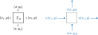
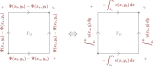
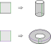

# Thema 4: Lösungsverfahren

In dem hier beschriebenen Verfahren wird die Finite-Differenzen-Methode angewendet, um das zweidimensionale Rand- und Anfangswertproblem zu lösen.

[TOC]

<!------------------------------------------------------------------------------
Problemstellung
------------------------------------------------------------------------------->
## Problemstellung

Bei den strömungsmechanischen Gleichungen handelt es sich um ein gekoppeltes System nichtlinearer partieller Differentialgleichungen. Für die numerische Berechnung wird dieses System zunächst im Ort aufgelöst, sodass dann nur noch ein gekoppeltes System linearer gewöhnlicher Differentialgleichungen in der Zeit verbleibt. Um die physikalischen Begebenheiten zu modellieren, werden Rand- und Anfangsbedingungen gesetzt. Diese Bedingungen sind fallabhängig und determinieren das Simulationsergebnis, weshalb hier besondere Vorsicht geboten ist.

### Randwertproblem

Das Randwertproblem besteht darin, die auf dem Randbereich vorliegenden Begebenheiten zu interpolieren. Topologisch ist der Rand _`Γ`_ als die Differenzmenge zwischen dem Abschluss und Inneren des entsprechenden Gebiets _`Ω`_ definiert – wobei der Abschluss die kleinste abgeschlossene Menge darstellt, welche dieses Gebiet enthält, und das Innere der größten vom Abschluss umschlossenen offenen Menge entspricht. Im Folgenden soll ein Quadrat als Beispiel dienen.

> **Abbildung (Definition Rand)**
>
> 

Die Möglichkeiten von Randbedingungen sind so vielfältig wie es das physikalische Modell eben nur zulässt. In diesem Kontext kommen die folgenden Randbedingungen in Frage:

---

<b>Randbedingungen 0. Ableitungsordnung (alias Dirichlet-Randbedingungen)</b>

 

Durch die Funktionswerte der Stromfunktion _`Ψ`_ wird die auf dem Rand _`Γ`_ senkrechte Geschwindigkeit definiert. Denn die Differenz der Stromfunktion entspricht, per Definition, dem orthogonalen Volumenstrom.

$$
\forall(x,y)\in\Gamma_\Omega\colon\quad d\Psi = u\,dy - v\,dx = d\dot{V}_x - d\dot{V}_y = d\dot{V}_\perp
$$

> **Abbildung (Dirichlet-Randbedingungen)**
>
> 

Diese Randbedingungen müssen außerdem die Kontinuitätsgleichung erfüllen, d. h. bei einer inkompressiblen Strömung fließt genau so viel Fluid in das Gebiet hinein wie hinaus.

$$
0 \overset{!}{=} \oint_{\Gamma_\Omega} d\Psi = \oint_{\Gamma_\Omega} d\dot{V}_\perp
$$

> **Abbildung (Kontinuitätsvoraussetzung)**
>
> 

---

<b>Randbedingungen 1. Ableitungsordnung (alias Neumann-Randbedingungen)</b>

 

Durch die Ableitung der Stromfunktion _`Ψ`_ senkrecht zum Rand _`Γ`_, wird dort die tangentiale Geschwindigkeit definiert, denn es gelten die Cauchy-Riemann-Gleichungen.

$$
\forall(x,y)\in\Gamma_\Omega\colon~
\begin{cases}
\partial_x \Psi = -v \\
\partial_y \Psi = u
\end{cases}
$$

> **Abbildung (Neumann-Randbedingungen)**
>
> 

---

<b>Periodische Randbedingungen</b>

 

Periodische Randbedingungen charakterisieren in gewisser Weise die Topologie des zugrundeliegenden Gebiets. Dadurch dass die jeweiligen Ränder miteinander identifiziert werden, entstehen neuartige Mannigfaltigkeiten. Anschaulich werden die Ränder dabei einfach verklebt.

> **Abbildung (Periodische Randbedingungen)**
>
> 

---
> **Aufgabe (Periodische Randbedingungen)**
>
> Wie lassen sich periodische Randbedingungen mit dem Finite-Differenzen-Verfahren realisieren?

---
> **Aufgabe (Keine Randbedingungen)**
>
> Was würde passieren, wenn gar keine Randbedingungen gesetzt werden? Wie ließe sich das physikalisch begründen?

### Anfangswertproblem

Das Anfangswertproblem besteht darin, die Begebenheiten zu einer bestimmten Zeit zu extrapolieren. Dabei wird die Annahme getroffen, dass das System zu diesem Zeitpunkt vollständig bestimmt ist und einer chronologischen Kausalität unterliegt. Es gibt also demzufolge keine zeitliche Rückwirkung. Von dieser Warte aus stellt das Anfangswertproblem so etwas wie eine einseitige Randbedingung, nur eben in der Zeit.

<!------------------------------------------------------------------------------
Lösungsalgorithmus
------------------------------------------------------------------------------->
## Lösungsalgorithmus

Der Lösungsalgorithmus erfolgt dreiteilig mit jedem Zeitschritt:

1. Lösung der Poisson-Gleichung für die Stromfunktion _**`Ψ`**_ mit der vorgegebenen Verteilung der Wirbelstärke _**`ω`**_.
2. Umrechnung der Stromfunktion _**`Ψ`**_ in die einzelnen Geschwindigkeitskomponenten _**`u`**_ und _**`v`**_ anhand der Cauchy-Riemann-Gleichungen.
3. Berechnung der Wirbelstärke _**`ω`**_ zum nächsten Zeitpunkt mittels Wirbeltransportgleichung und Wiederholung der Schleife beginnend bei 1., sofern die gewünschte Endzeit noch nicht erreicht ist.

_**Hinweis:** Damit der Laplace-Operator invertiert werden kann, muss das Rechengitter zunächst vektorisiert werden. Dementsprechend wird der Lösungsalgorithmus in dieser Form mit zweidimensionalen Ableitungsmatrizen formuliert. Hier bezeichnet $\odot$ das Hadamard-Produkt._

### Poisson-Gleichung

Bei der Lösung der Poisson-Gleichung fließen die Dirichlet-Randbedingungen ein, wodurch die Geschwindigkeit senkrecht zum Rand unter Berücksichtigung der Kontinuitätsgleichung festgelegt wird. Dafür wird ein Boole'scher Vektor _**`B`**_ definiert, welcher den Rand angibt.

$$
\boldsymbol{B}\colon
\begin{cases}
= 0 & \text{für }\Omega^\circ \\
= 1 & \text{für }\Gamma_\Omega
\end{cases}
$$

Unter Umständen ist es nicht erforderlich, auf dem gesamten Rand Bedingungen zu setzen. Der Vektor _**`B`**_ muss dann dementsprechend angepasst werden. Für die Poisson-Gleichung wird somit das folgende lineare Gleichungssystem mit den jeweiligen Dirichlet-Randbedingungen gelöst:

$$
\underbrace{\left[ \operatorname{diag}(\lnot \boldsymbol{B}) \cdot (\boldsymbol{D}_x^{(2)} + \boldsymbol{D}_y^{(2)}) + \operatorname{diag}(\boldsymbol{B}) \right]}_{\nabla^2\text{ für }\Omega^\circ\text{ bzw. } I\text{ für }\Gamma_\Omega} \boldsymbol{\Psi} = \underbrace{\lnot{\boldsymbol{B}}\odot(-\boldsymbol{\omega}) + \boldsymbol{B}\odot\boldsymbol{\Psi}_\Gamma}_{-\omega\text{ für }\Omega^\circ\text{ bzw. }\Psi_\Gamma\text{ für }\Gamma_\Omega}
$$

_**Tipp:** Wenn sich die Matrix des Gleichungssystems über die Zeit nicht verändert, dann kann ihre LR-Zerlegung aus der Zeititeration ausgelagert und somit Rechenzeit gespart werden. Möglicherweise muss außerdem auf die Konditionierung dieser Matrix geachtet werden._

### Cauchy-Riemann-Gleichungen

Bei der Berechnung der Geschwindigkeitskomponenten bietet es sich an, die Neumann-Randbedingungen einzubeziehen und somit, falls vorhanden, die Geschwindigkeit tangential zum Rand festzulegen. Auch hier lässt sich wieder mit einem Boole'schen Vektor _**`B`**_ arbeiten, welcher die entsprechenden Positionen dafür angibt.

$$
\begin{align*}
\boldsymbol{u} &= \underbrace{\lnot\boldsymbol{B}\odot(\boldsymbol{D}_y^{(1)}\boldsymbol{\Psi}) + \boldsymbol{B}\odot\boldsymbol{u}_\Gamma}_{\partial_y\Psi\text{ für }\Omega^\circ\text{ bzw. }u_\Gamma\text{ für }\Gamma_\Omega} \\\\
\boldsymbol{v} &= \underbrace{\lnot\boldsymbol{B}\odot(-\boldsymbol{D}_x^{(1)}\boldsymbol{\Psi}) + \boldsymbol{B}\odot\boldsymbol{v}_\Gamma}_{-\partial_x\Psi\text{ für }\Omega^\circ\text{ bzw. }v_\Gamma\text{ für }\Gamma_\Omega}
\end{align*}
$$

### Wirbeltransportgleichung

Die Randbedingungen sind in dem zuvor berechneten Geschwindigkeitsfeld enthalten, sodass die örtliche Auflösung bereits abgeschlossen ist und die Wirbelstärke zum nächsten Zeitpunkt berechnet werden kann. Damit die Randbedingungen korrekt in die bevorstehende Berechnung einfließen, muss unbedingt darauf geachtet werden, dass das Differenzenschema auch für den Randbereich konsistent ist.

$$
\dot{\boldsymbol{\omega}} = \underbrace{\left[ \nu(\boldsymbol{D}_x^{(2)} + \boldsymbol{D}_y^{(2)})\right.}_\text{Diffusion} - \underbrace{\left.(\operatorname{diag}(\boldsymbol{u})\cdot\boldsymbol{D}_x^{(1)} + \operatorname{diag}(\boldsymbol{v})\cdot\boldsymbol{D}_y^{(1)}) \right]}_\text{Konvektion} \boldsymbol{\omega}
$$
