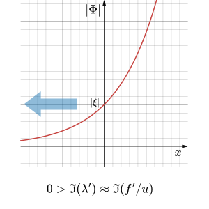
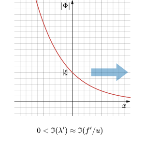
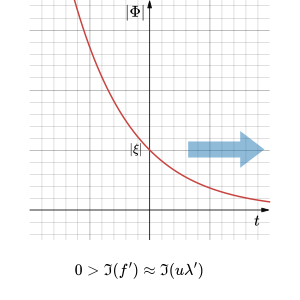
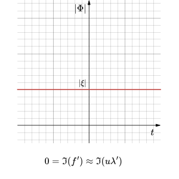
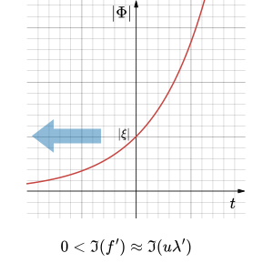

# Thema 5: Ergänzungen

Es wird zunächst eine analytische Lösung der eindimensionalen Transportgleichung hergeleitet, wie sie hier zum Einsatz kommt und damit als Ansatz dient, um die numerische Einflussnahme auf das Systemverhalten hinsichtlich der Stabilität zu untersuchen. Daraus ergeben sich diverse Möglichkeiten, die Approximationsverfahren zu kombinieren und auf die Problemstellung anzupassen, sodass die numerische Berechnung sicher und stabil vonstattengeht.

[TOC]

<!------------------------------------------------------------------------------
Analytische Lösung der eindimensionalen Transportgleichung
------------------------------------------------------------------------------->
## Analytische Lösung der eindimensionalen Transportgleichung

Für die eindimensionale Transportgleichung ohne Quellterm, lässt sich zu Vergleichszwecken eine analytische Lösung herleiten. Diese Gleichung ist gegeben durch

$$
\partial_t \Phi(x,t) = c\partial_x^2 \Phi(x,t) - u\partial_x \Phi(x,t),
$$

wobei _`c`_ die Dämpfungskonstante, _`u`_ die Transportgeschwindigkeit und _`Φ`_ die Strömungsgröße geschreibt. Mit der Wellenzahl _`λ:=2π/L`_, Frequenz _`f:=2π/T`_ und imaginären Einheit `i` lässt sich der folgende Ansatz wählen:

$$
\Phi(x,t) \sim \mathrm{e}^{\mathrm{i}(\lambda x - f t)}
$$

Wird dieser nun in die obige Transportgleichung eingesetzt, dann ergibt sich

$$
-\mathrm{i}f \mathrm{e}^{\mathrm{i}(\lambda x - f t)} = -c\lambda^2 \mathrm{e}^{\mathrm{i}(\lambda x - f t)} -iu\lambda \mathrm{e}^{\mathrm{i}(\lambda x - f t)}
$$

und gekürzt

$$
f = -\mathrm{i}c\lambda^2 + u\lambda,
$$

sodass die Frequenz in dem Ansatz substituiert werden kann, was durch Multiplikation mit einem Vorfaktor _`ξ`_ zur allgemeinen Lösung führt.

$$
\Phi(x,t) = \xi \mathrm{e}^{\mathrm{i}\lambda(x - u t)}\mathrm{e}^{-c\lambda^2 t}
$$

<!------------------------------------------------------------------------------
Numerisches Übertragungsverhalten
------------------------------------------------------------------------------->
## Numerisches Übertragungsverhalten

Das numerische Übertragungsverhalten gibt an, wie sich das gewählte Approximationsverfahren auf die Systemdynamik auswirkt. Wird die Transportgleichung zunächst ohne Diffusion (_`c=0`_) betrachtet, dann ergibt sich die Lösung durch die Exponentialfunktion mit komplexem Argument ohne Realteil

$$
\Phi(x,t) = \xi \mathrm{e}^{\mathrm{i}(\lambda x - f t)},
$$

sodass

$$
|\Phi(x,t)| = |\xi|.
$$

Wenn jedoch die Approximation der Ableitung die Wellenzahl im Raum bzw. die Frequenz in der Zeit derart modifiziert, dass im Argument der Exponentialfunktion ein Realteil entsteht, dann schlägt sich dies auf die Konvektion und Diffusion nieder, sodass

$$
|\Phi(x,t)| \approx |\xi\mathrm{e}^{\mathrm{i}(\lambda^\prime x - f^\prime t)}| \neq |\xi|.
$$

Da die Form der Lösung bekannt ist, kann in diesem Fall heuristisch davon ausgegangen werden, dass durch

$$
f = u\lambda \quad\Rightarrow\quad f^\prime \approx u\lambda^\prime
$$

ein Zusammenhang zwischen der räumlichen (konvektiven) und zeitlichen (diffusiven) Konzentrationsänderung besteht. So sollte die Wahl des Approximationsverfahrens mit Bedacht dieser Auswirkungen getroffen werden.

### Numerische Konvektion

Wenn sich die Approximation der Ableitung auf die räumliche Änderung der Konzentration auswirkt, dann ist von numerischer Konvektion die Rede. Um diesen Effekt zu untersuchen wird für die räumliche Ableitung

$$
t = 0
$$

gesetzt und für die zeitliche Ableitung mit der Heuristik

$$
\lambda = f / u \quad\Rightarrow\quad \lambda^\prime \approx f^\prime / u
$$

substituiert.

$$
\begin{alignat*}{3}
& \partial_x \Phi &&= \mathrm{i}\lambda\Phi &&\approx \mathrm{i}\lambda^\prime\Phi \\
\Rightarrow\quad& &&= \mathrm{i}(f / u)\Phi &&\approx \mathrm{i}(f^\prime / u)\Phi
\end{alignat*}
$$

Für die Konzentration folgt somit:

$$
\begin{alignat*}{5}
& |\Phi| &&= |\xi\mathrm{e}^{\mathrm{i}\lambda x}| &&\approx |\xi\mathrm{e}^{\mathrm{i}\lambda^\prime x}| &&= |\xi\mathrm{e}^{(-\Im(\lambda^\prime) + \mathrm{i}\Re(\lambda^\prime))x}| &&= |\xi\mathrm{e}^{-\Im(\lambda^\prime)x}| \\
\Rightarrow\quad& &&= |\xi\mathrm{e}^{\mathrm{i}(f / u)x}| &&\approx |\xi\mathrm{e}^{\mathrm{i}(f^\prime / u)x}| &&= |\xi\mathrm{e}^{(-\Im(f^\prime / u) + \mathrm{i}\Re(f^\prime / u))x}| &&= |\xi\mathrm{e}^{-\Im(f^\prime / u)x}|
\end{alignat*}
$$

> **Abbildung (Numerische Konvektion)**
>
>   

Dabei bestimmt der Imaginärteil der modifizierten Wellenzahl bzw. modifizierten Frequenz das numerische Konvektionsverhalten, wobei die räumliche Konzentrationsänderung (als Ursache) der Konvektion ebenjener Strömungsgröße entgegenwirkt.

### Numerische Diffusion

Wenn sich die Approximation der Ableitung auf die zeitliche Änderung der Konzentration auswirkt, dann ist von numerischer Diffusion die Rede. Um diesen Effekt zu untersuchen wird für die zeitliche Ableitung

$$
x = 0
$$

gesetzt und für die räumliche Ableitung mit der Heuristik

$$
f = u\lambda \quad\Rightarrow\quad f^\prime \approx u\lambda^\prime
$$

substituiert.

$$
\begin{alignat*}{3}
& \partial_t \Phi &&= -\mathrm{i}f\Phi &&\approx -\mathrm{i}f^\prime\Phi \\
\Rightarrow\quad& &&= -\mathrm{i}(u\lambda)\Phi &&\approx -\mathrm{i}(u\lambda^\prime)\Phi
\end{alignat*}
$$

Für die Konzentration folgt somit:

$$
\begin{alignat*}{5}
& |\Phi| &&= |\xi\mathrm{e}^{-\mathrm{i}f t}| &&\approx |\xi\mathrm{e}^{-\mathrm{i}f^\prime t}| &&= |\xi\mathrm{e}^{(\Im(f^\prime) - \mathrm{i}\Re(f^\prime))t}| &&= |\xi\mathrm{e}^{\Im(f^\prime)t}| \\
\Rightarrow\quad& &&= |\xi\mathrm{e}^{-\mathrm{i}(u\lambda)t}| &&\approx |\xi\mathrm{e}^{-\mathrm{i}(u\lambda^\prime)t}| &&= |\xi\mathrm{e}^{(\Im(u\lambda^\prime) - \mathrm{i}\Re(u\lambda^\prime))t}| &&= |\xi\mathrm{e}^{\Im(u\lambda^\prime)t}|
\end{alignat*}
$$

> **Abbildung (Numerische Diffusion)**
>
>   

Dabei bestimmt der Imaginärteil der modifizierten Frequenz bzw. modifizierten Wellenzahl das numerische Diffusionsverhalten, wobei die zeitliche Konzentrationsänderung (als Ursache) der Diffusion ebenjener Strömungsgröße entgegenwirkt.

### Beispiele

---
> **Begleitmaterial (Beispiele für das numerische Übertragungsverhalten)**
>
> [Hier befinden sich Beispielrechnungen zum numerischen Übertragungsverhalten.](Begleitmaterial/Uebertragungsverhalten.md)

<!------------------------------------------------------------------------------
Stabilitätsanalyse nach John von Neumann
------------------------------------------------------------------------------->
## Stabilitätsanalyse nach John von Neumann

Numerische und physikalische Stabilität sind zweierlei. Erstere muss unabhängig von letzterer gewährleistet sein, sonst läuft die numerische Berechnung unter Umständen Gefahr ins Unermessliche zu entfachen, wobei das Ergebnis mit der Zeit divergiert. Als während des 2. Weltkrieges die erste Rechnertechnik zur Verfügung stand und numerische Berechnungen dadurch an Bedeutung gewannen, war die numerische Stabilität mit das erste zu bewerkstelligende Problem. Eine Stabilitätsanalyse ist von daher als Sicherheitsvorkehrung einer jeden numerischen Berechnung nach wie vor unabdingbar.

Eine numerisch stabile Simulation zeichnet sich durch Approximationsverfahren aus, welche die Konvektion (in positiver Strömungsrichtung) und die Diffusion (im positiven Zeitverlauf) begünstigen. Um diese Eigenschaft messbar zu machen, wird die eindimensionale Transportgleichung ohne Quellterm in ihre Bestandteile zerlegt und separat auf Stabilität untersucht. Dafür wird eine räumliche Fourier-Mode als Ansatz verwendet,

$$
\Phi(x_j,t_l) = \xi^l \mathrm{e}^{\mathrm{i}\lambda j h_x},
$$

sodass, nach der Stabilitätsbedingung,

$$
\left| \frac{\Phi(x_j,t_{l+1})}{\Phi(x_j,t_l)} \right| = \left| \xi \right| \overset{!}{\leq} 1,
$$

die absoluten Funktionswerte in der Zeit monoton fallen. Außerdem lässt sich nach Richard Courant, Kurt Friedrichs und Hans Lewy für jede partikuläre Gleichung eine dimensionslose Zahl definieren, welche die notwendigen Modellparameter substituiert und dadurch die Angabe einer Stabilitätsbedingung ermöglicht.

### Konvektionsgleichung

Die Konvektionsgleichung entspricht der diffusions- und quellfreien Transportgleichung. Im Eindimensionalen ist sie somit gegeben durch

$$
\partial_t \Phi(x,t) = -u\partial_x \Phi(x,t).
$$

Die CFL-Zahl für den Konvektionsterm mit der 1. räumlichen Ableitung nach _`x`_ wird wie folgt definiert:

$$
\mathrm{CFL}_x \coloneqq |u|\frac{h_t}{h_x}
$$

### Diffusionsgleichung

Die Diffusionsgleichung entspricht der konvektions- und quellfreien Transportgleichung. Im Eindimensionalen ist sie somit gegeben durch

$$
\partial_t \Phi(x,t) = c\partial_x^2 \Phi(x,t).
$$

Die CFL-Zahl für den Diffusionsterm mit der 2. räumlichen Ableitung nach _`x`_ wird wie folgt definiert:

$$
\mathrm{CFL}_{xx} \coloneqq |c|\frac{h_t}{h_x^2}
$$

### Beispiele

---
> **Begleitmaterial (Beispiele für die Stabilitätsanalyse )**
>
> [Hier befinden sich Beispielrechnungen zur Stabilitätsanalyse.](Begleitmaterial/Stabilitaetsanalyse.md)

<!------------------------------------------------------------------------------
Implementierung angepasster Verfahren
------------------------------------------------------------------------------->
## Implementierung angepasster Verfahren

Bei der Implementierung der Approximationsverfahren geht es neben dem Rechenaufwand vorrangig um Stabilität und Genauigkeit. Unter Anbetracht der Stabilitätsanalyse und des Übertragungsverhaltens lassen sich dafür gezielt Vorkehrungen treffen.

### Aufwind-Differenzenverfahren

Die Finite-Differenzenschemata entgegen der Strömungsrichtung anzulegen, hat nicht nur einen stabilisierenden Effekt, sondern geht auch mit einer höheren Genauigkeit einher, zumal die Informationen mit der Strömung transportiert und somit rechtzeitig abgegriffen werden. Dafür wird der Konvektionsterm überall nach dem Vorzeichen der Geschwindigkeit angepasst:

$$
\left[\operatorname{diag}(\boldsymbol{u}_-)\cdot\boldsymbol{D}_{x+}^{(1)}+\operatorname{diag}(\boldsymbol{u}_+)\cdot\boldsymbol{D}_{x-}^{(1)} + \operatorname{diag}(\boldsymbol{v}_-)\cdot\boldsymbol{D}_{y+}^{(1)}+\operatorname{diag}(\boldsymbol{v}_+)\cdot\boldsymbol{D}_{y-}^{(1)}\right] \cdot
$$

Wobei

$$
\begin{align*}
    \boldsymbol{u}_- &= \min(\boldsymbol{u},\boldsymbol{0}), \\
    \boldsymbol{u}_+ &= \max(\boldsymbol{u},\boldsymbol{0}), \\
    \boldsymbol{v}_- &= \min(\boldsymbol{v},\boldsymbol{0}), \\
    \boldsymbol{v}_+ &= \max(\boldsymbol{v},\boldsymbol{0}), \\
\end{align*}
$$

und

$$
\begin{align*}
\begin{rcases}
    \boldsymbol{D}_{x-}^{(1)} \\
    \boldsymbol{D}_{y-}^{(1)}
\end{rcases}&~
\text{Rückwärtsdifferenzen}, \\
\begin{rcases}
    \boldsymbol{D}_{x+}^{(1)} \\
    \boldsymbol{D}_{y+}^{(1)}
\end{rcases}&~
\text{Vorwärtsdifferenzen}.
\end{align*}
$$

### Kombiniertes Zeitschrittverfahren

Bei der Stabilitätsanalyse hat sich die zeitliche Entwicklung mittels expliziten Euler-Verfahrens für die Diffusionsgleichung und mittels impliziten Euler-Verfahrens für die Konvektionsgleichung als stabil erwiesen. Da sich die Wirbeltransportgleichung sowohl aus dem Konvektionsterm als auch dem Diffusionsterm zusammensetzt, ist es evident, beide Zeitschrittverfahren so zu kombinieren, dass für die gesamte Gleichung Stabilität gewährleistet ist.

$$
\omega_z(t+h_t) \approx \omega_z(t) + h_t \underbrace{\left[ \nu\nabla^2\omega_z(t)\right.}_\text{explizit} - \underbrace{\left.\boldsymbol{u}(\omega_z(t+h_t))\cdot\boldsymbol{\nabla}\omega_z(t+h_t) \right]}_\text{implizit}
$$

Zusätzlich kann auch hier im Konvektionsterm das Aufwind-Differenzenverfahren eingebaut werden.

**Implizite Berechnung**

Für die implizite Berechnung des nächsten Funktionswertes wird die Vorschrift erst nach null aufgelöst,

$$
f({\color{red}z},t) \coloneqq \omega_z(t) - {\color{red}z} + h_t \left[ \nu\nabla^2\omega_z(t) - \boldsymbol{u}({\color{red}z})\cdot\boldsymbol{\nabla}{\color{red}z} \right]
$$

und dann das Newton-Verfahren zu jedem Zeitschritt sukzessiv angewendet:

$$
\forall t \in h_t\cdot\mathbb{N}\colon\quad f(z,t) \overset{!}{=} 0 \quad\Rightarrow\quad z \approx \omega_z(t+h_t)
$$

Der vorherige Funktionswert wird dabei jeweils als Startwert verwendet.

### Schiefsymmetrisches Konvektionsschema

Stabilität des Konvektionsschemas lässt sich durch Schiefsymmetrie auch ohne Beeinflussung der Diffusion erreichen. Jede Matrix $\boldsymbol{M}$ lässt sich in ein symmetrischen Teil $\boldsymbol{M}_s$ und ein schief- bzw. antisymmetrischen Teil $\boldsymbol{M}_a$ zerlegen:

$$
\boldsymbol{M} = \underbrace{\frac{\boldsymbol{M}+\boldsymbol{M}^\top}{2}}_{\eqqcolon \boldsymbol{M}_s} + \underbrace{\frac{\boldsymbol{M}-\boldsymbol{M}^\top}{2}}_{\eqqcolon \boldsymbol{M}_a} = \boldsymbol{M}_s + \boldsymbol{M}_a
$$

Dabei gilt $\boldsymbol{M}_s^\top=\boldsymbol{M}_s$ und $\boldsymbol{M}_a^\top=-\boldsymbol{M}_a$. Die Grundidee ist, dass eine schiefsymmetrische Matrix $\boldsymbol{M}_a$ als alternierende Bilinearform über dem selben Vektorfeld $\boldsymbol{v}$ verschwindet und damit die entsprechende Norm der Strömungsgröße erhält:

$$
z = \boldsymbol{v}^\top \boldsymbol{M}_a \boldsymbol{v} = (\boldsymbol{v}^\top \boldsymbol{M}_a \boldsymbol{v})^\top = - \boldsymbol{v}^\top \boldsymbol{M}_a \boldsymbol{v} = -z
$$

Für den skalaren Wert folgt daraus unmittelbar $z=0$. In den vorliegenden Gleichungen kann Schiefsymmetrie hergestellt werden, indem die sog. konservative und nicht-konservative Form gemittelt werden. Die konservative Form der Wirbeltransportgleichung ist gegeben durch

$$
\partial_t \omega_z + \boldsymbol{\nabla}\cdot(\boldsymbol{u}\omega_z) = \nu\nabla^2\omega_z
$$

und die nicht-konservative Form durch

$$
\partial_t \omega_z + \boldsymbol{u}\cdot\boldsymbol{\nabla}\omega_z = \nu\nabla^2\omega_z,
$$

wobei sich nur der Konvektionsterm

$$
\boldsymbol{\nabla}\cdot(\boldsymbol{u}\omega_z) = \omega_z\boldsymbol{\nabla}\cdot\boldsymbol{u} + \boldsymbol{u}\cdot\boldsymbol{\nabla}\omega_z
$$

unterscheidet, aber unter Inkompressibilität identisch ist. Die Mittelung der beiden Varianten für den Konvektionsterm führt zu folgendem Ausdruck:

$$
\begin{align*}
\frac{1}{2}\left(\boldsymbol{\nabla}\cdot(\boldsymbol{u}\omega_z) + \boldsymbol{u}\cdot\boldsymbol{\nabla}\omega_z\right) &= \frac{1}{2}\left( \sum_i \partial_{x_i}(u_i\omega_z) + u_i\partial_{x_i}\omega_z \right) \\
&= \frac{1}{2}\left( \sum_i \omega_z\partial_{x_i}u_i + u_i\partial_{x_i}\omega_z + u_i\partial_{x_i}\omega_z \right) \\
&= \sum_i \frac{1}{2}\omega_z\partial_{x_i}u_i + u_i\partial_{x_i}\omega_z \\
&= \sum_i \sqrt{u_i}\, \partial_{x_i} (\sqrt{u_i}\, \omega_z) \\
&= (\sqrt{\boldsymbol{u}} \odot \boldsymbol{\nabla}) \cdot (\sqrt{\boldsymbol{u}}\,\omega_z)
\end{align*}
$$

Wobei die Komplexität der Wurzelausdrücke zu beachten ist. Nach erfolgreicher Berechnung des Konvektionsterms ist jedoch nur noch der Realteil entscheidend, sodass nur dieser abgespeichert werden muss.

Betrachten wir nun die Wirbeltransportgleichung ohne Diffusion, indem wir die Viskosität zu null setzen und mit der Wirbelstärke von links multiplizieren,

$$
\omega_z\partial_t\omega_z = \frac{1}{2}\partial_t\omega_z^2 = -\omega_z(\sqrt{\boldsymbol{u}} \odot \boldsymbol{\nabla}) \cdot (\sqrt{\boldsymbol{u}}\omega_z) \overset{!}{=} 0,
$$

stellen wir fest, dass sich der Ausdruck als eine alternierende Bilinearform schreiben lässt, sofern der Differentialoperator $\boldsymbol{\nabla}$ schiefsymmetrisch ist (was bei einem zentralen Differenzenschema ohne Rand der Fall ist), dabei entsprechend verschwindet und die Norm der Wirbelstärke erhält.

---
> **Aufgabe (Bezug zur Enstrophie)**
>
> Zeigt, dass über den Zusammenhang mit der Enstrophie auch die kinetische Energie erhalten ist, indem ihr die Kontraktion der Bilinearform als diskrete räumliche Integration auffasst.
