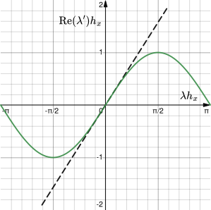
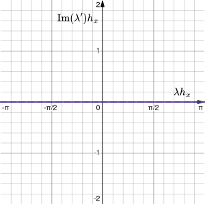
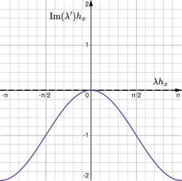

# Thema 5: Ergänzungen

Hier wird zunächst eine analytische Ansatzfunktion für die eindimensionale Transportgleichung vorgestellt, um damit anschließend numerische Diffusion und Stabilität zu erläutern. Auf-/Abwind-Differenzenschemata können dabei helfen, die Simulation numerisch zu stabilisieren, gehen aber mit einer numerischen Diffusion einher.

[TOC]

<!------------------------------------------------------------------------------
Analytische Ansatzfunktion
------------------------------------------------------------------------------->
## Analytische Ansatzfunktion

Für die eindimensionale Transportgleichung ohne Quellterm, lässt sich eine analytische Lösung herleiten, damit das numerische Diskretisierungsverfahren auf die Probe gestellt werden kann. Diese Gleichung ist gegeben durch

$$
\partial_t \Phi(x,t) = c\partial_x^2 \Phi(x,t) - u\partial_x \Phi(x,t),
$$

wobei _`c`_ die Dämpfungskonstante, _`u`_ die Transportgeschwindigkeit und _`Φ`_ die Strömungsgröße geschreibt. Mit der Wellenzahl _`λ:=2π/L`_, Kreisfrequenz _`f:=2π/T`_ und imaginären Einheit `i` lässt sich der folgende Ansatz wählen:

$$
\Phi(x,t) \sim \mathrm{e}^{\mathrm{i}(\lambda x - f t)}
$$

Wird dieser nun in die obige Transportgleichung eingesetzt, dann ergibt sich

$$
-\mathrm{i}f \mathrm{e}^{\mathrm{i}(\lambda x - f t)} = -c\lambda^2 \mathrm{e}^{\mathrm{i}(\lambda x - f t)} -iu\lambda \mathrm{e}^{\mathrm{i}(\lambda x - f t)}
$$

und gekürzt

$$
f = -\mathrm{i}c\lambda^2 + u\lambda,
$$

sodass die Kreisfrequenz in dem Ansatz substituiert werden kann, was durch Multiplikation mit einem Vorfaktor _`ξ`_ zur allgemeinen Lösung führt.

$$
\Phi(x,t) = \xi \mathrm{e}^{\mathrm{i}\lambda(x - u t)}\mathrm{e}^{-c\lambda^2 t}
$$

<!------------------------------------------------------------------------------
Übertragungsverhalten und numerische Diffusion
------------------------------------------------------------------------------->
## Übertragungsverhalten und numerische Diffusion

Über die analytische Ansatzfunktion lässt sich das sog. Übertragungsverhalten der numerischen Auflösung ausfindig machen. Dafür wird die analytische Lösung der Transportgleichung mit _`t=0`_, _`ξ=1`_ und _`c=0`_ in das entsprechende Differenzenschema eingesetzt und die so approximierte Ableitung mit dem analytischen Ergebnis verglichen:

$$
\begin{alignat*}{5}
\partial_x \Phi &= ~~~~~(\mathrm{i}\lambda) \Phi &&\eqqcolon \Lambda_x \Phi \quad&&\approx\quad~~~~~ (\mathrm{i}\lambda^\prime) \Phi &&= ~(-\operatorname{Im}\lambda^\prime + \mathrm{i}\operatorname{Re}\lambda^\prime) \Phi &&\eqqcolon \Lambda_x^\prime \Phi \\
\partial_t \Phi &= (-\mathrm{i}u\lambda) \Phi &&\eqqcolon \Lambda_t \Phi \quad&&\approx\quad (-\mathrm{i}u\lambda^\prime) \Phi &&= (u\operatorname{Im}\lambda^\prime - \mathrm{i}u\operatorname{Re}\lambda^\prime) \Phi &&\eqqcolon \Lambda_t^\prime \Phi
\end{alignat*}
$$

Dass sich dabei der Zusammenhang über die modifizierte Wellenzahl _`λ'`_ des Differenzenschemas auch auf die zeitliche Ableitung überträgt, ist als eine heuristische Schlussfolgerung zu verstehen. Denn wie konkret dieser Zusammenhang besteht, ist von dem gewählten Zeitschrittverfahren abhängig. Dennoch lässt diese Überlegung mit den modifizierten Eigenwerten _`Λ'`_ Rückschlüsse auf numerische Diffusion zu, da die physikalische Diffusion mit _`c=0`_ anfangs ausgeschlossen wurde:

$$
\begin{align*}
\operatorname{sgn}(\operatorname{Re}\Lambda_x^\prime) &= -\operatorname{sgn}(\operatorname{Im} \lambda^\prime) \\
\operatorname{sgn}(\operatorname{Re}\Lambda_t^\prime) &= \operatorname{sgn}(u \operatorname{Im} \lambda^\prime)
\end{align*}
$$

- Hat die räumliche Ableitung einen Eigenwert mit negativem Realanteil, dann begünstigt sie Konvektion in positiver Strömungsrichtung und wirkt ihr in negativer Strömungsrichtung entgegen. Hat sie hingegen einen Eigenwert mit positivem Realanteil, dann begünstigt sie Konvektion in negativer Strömungsrichtung und wirkt ihr in positiver Strömungsrichtung entgegen – also genau andersherum. Die physikalische Begründung besagt in jedem Fall, dass die räumliche Änderung der Strömungsgröße ein Konzentrationsgefälle beschreibt, was es je nach Strömungsrichtung entweder auszugleichen oder zu überwinden gilt. Der Realanteil von diesem Eigenwert gibt also den räumlichen Konzentrationszuwachs an.

- Hat die zeitliche Ableitung einen Eigenwert mit negativem Realanteil, dann nimmt die Konzentration der Strömungsgröße mit der Zeit ab. Hat sie hingegen einen Eigenwert mit positivem Realanteil, dann nimmt die Konzentration mit der Zeit zu. Dementsprechend gibt der Realanteil von diesem Eigenwert den zeitlichen Konzentrationszuwachs an.

Da der Realanteil beider Eigenwerte nach dem analytischen Ergebnis nicht vorhanden sein sollte, ist er als ein numerisches Artefakt zu deuten, was den Diffusionsprozess beeinflusst. Es stellt sich heraus, dass es gerade die asymmetrischen Differenzenschemata sind, welche diesen Effekt herbeiführen. Dieser Effekt lässt sich im Sinne der numerischen Stabilität ausnutzen, indem sog. Auf-/Abwind-Differenzenschemata genau entgegen der Strömungsrichtung angelegt werden:

$$
\begin{align*}
\operatorname{sgn}(\operatorname{Re}\Lambda_x^\prime) &= \operatorname{sgn}(u) \\
\operatorname{sgn}(\operatorname{Re}\Lambda_t^\prime) &= -1
\end{align*}
$$

---

<b>Beispiel: Zentraldifferenz 2. Ordnung</b>

 

$$
\begin{align*}
\partial_x \Phi(x_j,0) &\approx \frac{1}{2 h_x}\left[ \Phi(x_{j+1},0)-\Phi(x_{j-1},0) \right] \\
\mathrm{i}\lambda \mathrm{e}^{\mathrm{i}\lambda j h_x} &\approx \frac{1}{2 h_x}\left[ \mathrm{e}^{\mathrm{i}\lambda (j+1) h_x}-\mathrm{e}^{\mathrm{i}\lambda (j-1) h_x} \right] \\
&\approx \frac{1}{2 h_x}\left[ \mathrm{e}^{\mathrm{i}\lambda h_x}-\mathrm{e}^{-\mathrm{i}\lambda h_x} \right] \mathrm{e}^{\mathrm{i}\lambda j h_x} \\
&\approx \mathrm{i}\underbrace{\left[\frac{\sin(\lambda h_x)}{h_x}\right]}_{\eqqcolon \lambda^\prime} \mathrm{e}^{\mathrm{i}\lambda j h_x}
\end{align*}
$$

Die modifizierte Wellenzahl hat keinen Imaginäranteil und es wird somit auch keine numerische Diffusion verursacht.

> **Abbildung (Modifizierte Wellenzahl)**
>
>  

---

<b>Beispiel: Rückwärtsdifferenz 1. Ordnung</b>

 

$$
\begin{align*}
\partial_x \Phi(x_j,0) &\approx \frac{1}{h_x}\left[ \Phi(x_{j},0)-\Phi(x_{j-1},0) \right] \\
\mathrm{i}\lambda \mathrm{e}^{\mathrm{i}\lambda j h_x} &\approx \frac{1}{h_x}\left[ \mathrm{e}^{\mathrm{i}\lambda j h_x}-\mathrm{e}^{\mathrm{i}\lambda (j-1) h_x} \right] \\
&\approx \frac{1}{h_x}\left[ 1-\mathrm{e}^{-\mathrm{i}\lambda h_x} \right] \mathrm{e}^{\mathrm{i}\lambda j h_x} \\
&\approx \frac{1}{h_x}\left[ 1-\cos(\lambda h_x)+\mathrm{i}\sin(\lambda h_x) \right] \mathrm{e}^{\mathrm{i}\lambda j h_x} \\
&\approx \mathrm{i}\underbrace{\left[ \frac{\sin(\lambda h_x)}{h_x}+\mathrm{i}\frac{\cos(\lambda h_x)-1}{h_x} \right]}_{\eqqcolon \lambda^\prime} \mathrm{e}^{\mathrm{i}\lambda j h_x} \\
\end{align*}
$$

Die modifizierte Wellenzahl hat einen Imaginäranteil und es wird somit numerische Diffusion verursacht.

> **Abbildung (Modifizierte Wellenzahl)**
>
>  

---
> **Aufgabe (Implementierung des Auf-/Abwind-Differenzenschemas)**
>
> Implementiert das Auf-/Abwind-Differenzenschema für die erste Ableitung in der Wirbeltransportgleichung.

---
> **Aufgabe (Modifizierte Wellenzahlen höherer Ordnung)**
>
> Welche modifizierten Wellenzahlen haben Differenzenschemata höherer Ordnung und wie lassen sich diese hinsichtlich der numerischen Genauigkeit beurteilen?

<!------------------------------------------------------------------------------
Von-Neumann-Stabilitätsanalyse
------------------------------------------------------------------------------->
## Von-Neumann-Stabilitätsanalyse

Auch wenn ein analytischer Zusammenhang zwischen der räumlichen und zeitlichen Auflösung besteht, ist es im Allgemeinen nicht so einfach einen numerischen Stabilitätsnachweis zu führen. Eine gute erste Näherung für das CFL-Kriterium bietet die Stabilitätsanalyse nach J. von Neumann, bei der die Transportgleichung ohne Quell- und Diffusionsterm, also nur mit Konvektionsterm herangezogen wird.

$$
\partial_t \Phi(x,t) = - u\partial_x \Phi(x,t)
$$

Für die numerisch stabile Simulation von allgemeinen Transportprozessen bietet diese Analyse somit immerhin eine notwendige, aber noch keine hinreichende Bedingung. Numerische Stabilität bedeutet dabei in erster Linie, dass sich die betrachtete Größe über die Zeit nicht weiter vergrößert und ist somit eine arithmetische Sicherheitsvorkehrung.

$$
|\Phi(x_j,h_t)| \overset{!}{\leq} |\Phi(x_j,0)|
$$

Unter dem Gesichtspunkt von Quell- und Diffusionsfreiheit stellt diese Annahme keinen physikalischen Widerspruch dar – was jedoch nicht bedeutet, dass numerische Diffusion physikalisch ist. Dabei wird die Beziehung oft als ein Verhältnis angegeben:

$$
\frac{\Phi(x_j,h_t)}{\Phi(x_j,0)} = \xi,\quad |\xi|\overset{!}{\leq} 1
$$

Sodass wieder der vorherige Ansatz verwendet werden kann, nur dass die Strömungsgröße zum nächsten Zeitpunkt einem Vielfachen entspricht.

$$
\Phi(x_j,0)=\mathrm{e}^{\mathrm{i}\lambda j h_x},\quad \Phi(x_j,h_t)=\xi\Phi(x_j,0)=\xi\mathrm{e}^{\mathrm{i}\lambda j h_x}
$$

---

<b>Beispiel: Euler explizit mit Zentraldifferenz 2. Ordnung</b>

 

$$
\begin{align*}
\Phi(x_j,h_t) &\approx \Phi(x_j,0) + h_t \partial_t \Phi(x_j,0) \\
&\approx \Phi(x_j,0) + h_t \left[-u \partial_x \Phi(x_j,0) \right] \\
&\approx \Phi(x_j,0) - \frac{u h_t}{2 h_x} \left[ \Phi(x_{j+1},0)-\Phi(x_{j-1},0) \right] \\
\xi \mathrm{e}^{\mathrm{i}\lambda j h_x} &\approx \mathrm{e}^{\mathrm{i}\lambda j h_x} - \frac{u h_t}{2 h_x} \left[ \mathrm{e}^{\mathrm{i}\lambda (j+1) h_x}-\mathrm{e}^{\mathrm{i}\lambda (j-1) h_x} \right] \\
\xi &\approx 1 - \frac{u h_t}{2 h_x} \left[ \mathrm{e}^{\mathrm{i}\lambda h_x}-\mathrm{e}^{-\mathrm{i}\lambda h_x} \right] \\
&\approx 1 - \operatorname{sgn}(u)\cdot \mathrm{CFL} \cdot\mathrm{i}\sin(\lambda h_x) \\\\
\Rightarrow\qquad 1 &\geq \left|1 - \operatorname{sgn}(u)\cdot \mathrm{CFL} \cdot\mathrm{i}\sin(\lambda h_x)\right| \\
\mathrm{CFL} &= 0
\end{align*}
$$

Das Verfahren ist ausnahmslos instabil.

---

<b>Beispiel: Euler explizit mit Rückwärtsdifferenz 1. Ordnung</b>

 

$$
\begin{align*}
\Phi(x_j,h_t) &\approx \Phi(x_j,0) + h_t \partial_t \Phi(x_j,0) \\
&\approx \Phi(x_j,0) + h_t \left[-u \partial_x \Phi(x_j,0) \right] \\
&\approx \Phi(x_j,0) - \frac{u h_t}{h_x} \left[ \Phi(x_{j},0)-\Phi(x_{j-1},0) \right] \\
\xi \mathrm{e}^{\mathrm{i}\lambda j h_x} &\approx \mathrm{e}^{\mathrm{i}\lambda j h_x} - \frac{u h_t}{h_x} \left[ \mathrm{e}^{\mathrm{i}\lambda j h_x}-\mathrm{e}^{\mathrm{i}\lambda (j-1) h_x} \right] \\
\xi &\approx 1 - \frac{u h_t}{h_x} \left[ 1-\mathrm{e}^{-\mathrm{i}\lambda h_x} \right] \\
&\approx 1 - \operatorname{sgn}(u)\cdot \mathrm{CFL} \cdot \left[ 1-\cos(\lambda h_x)+\mathrm{i}\sin(\lambda h_x) \right] \\\\
\Rightarrow\qquad 1 &\geq \left|1 - \operatorname{sgn}(u)\cdot \mathrm{CFL} \cdot \left[ 1-\cos(\lambda h_x)+\mathrm{i}\sin(\lambda h_x) \right]\right| \\
&\geq \left[ 1 - \operatorname{sgn}(u)\cdot \mathrm{CFL} \cdot \left[ 1-\cos(\lambda h_x) \right] \right]^2 +\left[\mathrm{CFL}\cdot \sin(\lambda h_x) \right]^2 \\
&\geq \ldots \\
&\geq 1 + 2\left[ 1-\cos(\lambda h_x) \right] \left[ \mathrm{CFL} \left[ \mathrm{CFL} - \operatorname{sgn}(u) \right] \right] \\
&\!\!\!\!\!\!\!\!\!\!\!\!\!\!\!\!\mathrm{CFL} \begin{cases}\leq 1, &\operatorname{sgn}(u)=1 \\ =0, &\operatorname{sgn}(u)<1 \end{cases}
\end{align*}
$$

Das Verfahren ist in Abhängigkeit von der Strömungsrichtung bedingt stabil.

---

<b>Beispiel: Euler implizit mit Zentraldifferenz 2. Ordnung</b>

 

$$
\begin{align*}
\Phi(x_j,h_t) &\approx \Phi(x_j,0) + h_t \partial_t \Phi(x_j,h_t) \\
&\approx \Phi(x_j,0) + h_t \left[-u \partial_x \Phi(x_j,h_t) \right] \\
&\approx \Phi(x_j,0) - \frac{u h_t}{2 h_x} \left[ \Phi(x_{j+1},h_t)-\Phi(x_{j-1},h_t) \right] \\
\xi \mathrm{e}^{\mathrm{i}\lambda j h_x} &\approx \mathrm{e}^{\mathrm{i}\lambda j h_x} - \frac{u h_t}{2 h_x} \left[ \xi\mathrm{e}^{\mathrm{i}\lambda (j+1) h_x}-\xi\mathrm{e}^{\mathrm{i}\lambda (j-1) h_x} \right] \\
\xi &\approx \left[ 1 + \operatorname{sgn}(u)\cdot \mathrm{CFL} \cdot\mathrm{i}\sin(\lambda h_x) \right]^{-1} \\\\
\Rightarrow\qquad 1 &\geq \left|1 + \operatorname{sgn}(u)\cdot \mathrm{CFL} \cdot\mathrm{i}\sin(\lambda h_x)\right|^{-1} \\
\mathrm{CFL} &\geq 0
\end{align*}
$$

Das Verfahren ist unbedingt stabil.

---

<b>Beispiel: Euler implizit mit Rückwärtsdifferenz 1. Ordnung</b>

 

$$
\begin{align*}
\Phi(x_j,h_t) &\approx \Phi(x_j,0) + h_t \partial_t \Phi(x_j,h_t) \\
&\approx \Phi(x_j,0) + h_t \left[-u \partial_x \Phi(x_j,h_t) \right] \\
&\approx \Phi(x_j,0) - \frac{u h_t}{h_x} \left[ \Phi(x_{j},h_t)-\Phi(x_{j-1},h_t) \right] \\
\xi \mathrm{e}^{\mathrm{i}\lambda j h_x} &\approx \mathrm{e}^{\mathrm{i}\lambda j h_x} - \frac{u h_t}{h_x} \left[ \xi\mathrm{e}^{\mathrm{i}\lambda j h_x}-\xi\mathrm{e}^{\mathrm{i}\lambda (j-1) h_x} \right] \\
\xi &\approx \left[1 + \operatorname{sgn}(u)\cdot \mathrm{CFL} \cdot \left[ 1-\cos(\lambda h_x)+\mathrm{i}\sin(\lambda h_x) \right]\right]^{-1} \\\\
\Rightarrow\qquad 1 &\geq \left|1 + \operatorname{sgn}(u)\cdot \mathrm{CFL} \cdot \left[ 1-\cos(\lambda h_x)+\mathrm{i}\sin(\lambda h_x) \right]\right|^{-1} \\
&\leq \left[ 1 + \operatorname{sgn}(u)\cdot \mathrm{CFL} \cdot \left[ 1-\cos(\lambda h_x) \right] \right]^2 +\left[\mathrm{CFL}\cdot \sin(\lambda h_x) \right]^2 \\
&\leq \ldots \\
&\leq 1 + 2\left[ 1-\cos(\lambda h_x) \right] \left[ \mathrm{CFL} \left[ \mathrm{CFL} + \operatorname{sgn}(u) \right] \right] \\
&\!\!\!\!\!\!\!\!\!\!\!\!\!\!\!\!\mathrm{CFL} \begin{cases}\geq 0, &\operatorname{sgn}(u)=1 \\ \leq 1, &\operatorname{sgn}(u)<1 \end{cases}
\end{align*}
$$

Das Verfahren ist in Abhängigkeit von der Strömungsrichtung bedingt stabil.

---
> **Aufgabe (CFL-Kriterium des Runge-Kutta-Verfahrens)**
>
> Wie lautet das CFL-Kriterium für das klassische Runge-Kutta-Verfahren unter Verwendung der Zentraldifferenz 2. Ordnung?
