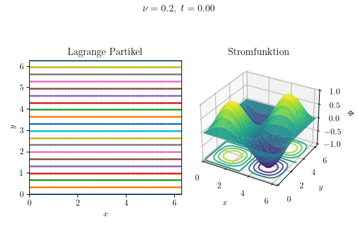

# Thema 6: Anwendungsbeispiele

Nach ein paar Hinweisen zur Programmierung, wird hier der Taylor-Green-Wirbel als Beispiel für die numerische Untersuchung vorgestellt. Dahingegen ist die Implementierung der Zylinderumströmung technisch anspruchsvoller, soll aber trotzdem nicht unerwähnt bleiben.

[TOC]

<!------------------------------------------------------------------------------
Bewährte Programmierpraktiken
------------------------------------------------------------------------------->
## Bewährte Programmierpraktiken

Wenn an einem größeren Programmcode gearbeitet wird, dann ist eine gewisse Sorgfalt geboten. Denn das Einhalten von Konvention macht die Entwicklung, für alle Beteiligten, sehr viel leichter. Genauso wie das wissenschaftliche Arbeiten zum Verfassen von fundierten Berichten gehört, so ist auch der Programmierstil für die Entwicklung von Programmcode maßgeblich. Dazu folgende Anmerkungen.

1. **Dokumentation:** Der Programmcode lässt sich durch Kommentare in Sinnabschnitte unterteilen. Außerdem bietet es sich an, mit einem sog. Docstring, kurze Funktionsbeschreibungen vorzunehmen.

2. **Vermeidung von Redundanz:** Werte die mehrmals vorkommen, sollten als Variablen verwendet werden. Routinen welche mehrmals vorkommen, sollten als Funktionen ausgelagert werden.

3. **Objektorientierung:** Matlab und Python sind objektorientierte Programmiersprachen. Es bietet sich an, diese Funktionalität zu nutzen, indem für die Simulation eine Klasse mit Parametern und den Ableitungsmatrizen als Attributen initialisiert wird, sodass diese anschließend von jeder Subfunktion genutzt werden können.

<!------------------------------------------------------------------------------
Taylor-Green-Wirbel
------------------------------------------------------------------------------->
## Taylor-Green-Wirbel

Für den hier betrachteten zweidimensionalen Wirbel hat erstmals Geoffrey I. Taylor allein eine analytische Lösung hergeleitet (On the decay of vortices in a viscous fluid – 1923). Fälschlicherweise wird dieses Resultat oft auf seine Zusammenarbeit mit Albert E. Green von 1937 zurückgeführt, obwohl diese Veröffentlichung gar nicht die besagte Herleitung enthält. Der dort betrachtete Wirbel ist nämlich dreidimensional und baut insofern auf den vorherigen Erkenntnissen auf. Trotzdem werden in der Literatur beide Fälle meist als »Taylor-Green-Wirbel« bezeichnet.

### Analytische Lösung

Die Herleitung ist so simpel wie genial. Ausgehend von der Wirbeltransportgleichung für zweidimensionale inkompressible Strömungen

$$
\partial_t \omega_z + \boldsymbol{u} \cdot \boldsymbol{\nabla}\omega_z = \nu\nabla^2\omega_z
$$

wird die Annahme einer allgemeinen Beltrami-Strömung getroffen, dass sich die Wirbelstärke entlang von Stromlinien konstant verhält, also in diesem Fall ein $\eta$-Faches der Stromfunktion darstellt:

$$
\omega_z = \eta\Psi
$$

Die Poisson-Gleichung hängt dann nur noch von der Stromfunktion ab und in der Wirbeltransportgleichung entfällt der Konvektionsterm, da der Gradient der Stromfunktion senkrecht zur Geschwindigkeit ist. Die beiden Ansätze

$$
\Psi \sim \mathrm{e}^{-\nu\eta t}
$$

für die Wirbeltransportgleichung und

$$
\Psi \sim \sin(x)\sin(y)
$$

für die Poisson-Gleichung, lassen sich kombiniert einsetzten, was zu einem bestimmten Wert für $\eta$ und somit zu einer analytischen Lösung führt.

---
> **Aufgabe (Herleitung der analytischen Lösung des Taylor-Green-Wirbels)**
>
> Leitet die analytische Lösung des Taylor-Green-Wirbels her.

### Visualisierungsbeispiel

Die Lösung lässt sich durch das Verfolgen sog. Lagrange-Partikel visualisieren. Hierzu wird auf dem Rechengebiet eine Startverteilung masseloser Punkte gewählt und deren Position nach der Lagrange'schen Betrachtungsweise in der Zeit durch Interpolation des Geschwindigkeitsvektorfeldes entwickelt.

$$
\boldsymbol{p}(t) = \boldsymbol{p}(t_0) + \int_{t_0}^t \dot{\boldsymbol{p}}(\tau) \, d\tau = \boldsymbol{p}(t_0) + \int_{t_0}^t \boldsymbol{u}(\tau) \, d\tau
$$

Hier wird dafür exemplarisch das explizite Euler-Verfahren verwendet. Stattdessen lassen sich aber auch andere Zeitschrittverfahren verwenden, um eine noch bessere Genauigkeit der Darstellung zu erzielen.

$$
\boldsymbol{p}(t+h_t) \approx \boldsymbol{p}(t) + h_t \cdot \dot{\boldsymbol{p}}(t) = \boldsymbol{p}(t) + h_t \cdot \boldsymbol{u}(t)
$$

> **Begleitmaterial (Visualisierung des Taylor-Green-Wirbels)**
>
>  
>
> 
>
> 

---
> **Aufgabe (Topologie des Taylor-Green-Wirbels)**
>
> Welche Topologie liegt dem Taylor-Green-Wirbel mit periodischen Randbedingungen zugrunde?

---
> **Aufgabe (Vergleich der Enstrophie)**
>
> Vergleicht bei eurer Simulation die Enstrophie mit dem analytischen Ergebnis, indem ihr das zweidimensionale Volumenintegral über die Riemann-Summe approximiert. Wie hängt der Verlauf von den gewählten Differenzen- und Zeitschrittverfahren ab und wann tritt numerische Diffusion auf? (Die Enstrophie müsste im diffusionsfreien Fall eine Erhaltungsgröße sein.)

---
> **Aufgabe (Vergleich der Laufzeit)**
>
> Wie verändert sich die Laufzeit eures Lösungsalgorithmus mit der Fehlerordnung der gewählten Differenzenschemata und wie viel länger braucht das implizite Zeitschrittverfahren im Vergleich zu einem expliziten? Ist der höhere Rechenaufwand durch bessere Stabilität und Genauigkeit gerechtfertigt?

<!------------------------------------------------------------------------------
Zylinderumströmung
------------------------------------------------------------------------------->
## Zylinderumströmung

Ein klassisches Beispiel stellt die Zylinderumströmung dar, ist aber technisch schwieriger zu implementieren als der Taylor-Green-Wirbel. Außerdem ist für dieses Problem keine analytische Lösung bekannt. Neben der Ein- und Auslassrandbedingung muss an der Zylinderoberfläche noch eine Wandrandbedingung mit Wandhaftung gesetzt werden. In kartesischen Koordinaten ist das mit der finiten Differenzen-Methode recht anspruchsvoll. Darum werden die Gleichungen im Folgenden in (logarithmischen) Polarkoordinaten vorgestellt. Dafür sollen sie aber zunächst entdimensionalisiert werden, um die Strömung anhand der Reynolds-Zahl

$$
\mathrm{Re} = \frac{2r_0 u_\infty}{\nu}
$$

zu charakterisieren. Wobei hier der Zylinderradius und die Anströmungsgeschwindigkeit verwendet wird.

---

<b>Entdimensionalisierung</b>

 

Wird der Zusammenhang mit der Reynolds-Zahl in die Gleichungen eingesetzt,

$$
\begin{align*}
    \omega_z &= -\nabla^2\psi \\
    \boldsymbol{u} &= \begin{bmatrix} \partial_y\psi \\ - \partial_x\psi \end{bmatrix} \\
    \partial_t\omega_z &= \left( \frac{2r_0 u_\infty}{\mathrm{Re}}\nabla^2-\boldsymbol{u}\cdot\boldsymbol{\nabla} \right) \omega_z
\end{align*}
$$

dann finden sich insgesamt 9 dimensionsbehaftete Größen wieder:

$$
    t,~ \omega_z,~ \psi,~ x,~ y,~ u,~ v,~ r_0,~ u_\infty
$$

Rein theoretisch könnte hier auch die Startverteilung der Wirbelstärke mitgezählt werden. Wird der Zylinderradius und die Anströmungsgeschwindigkeit zum Entdimensionalisieren verwendet, dann sind das (laut dem Buckingham'schen Π-Theorem) genau zwei Größen, um die sich diese Anzahl verringert. Die Wahl dieser Größen ist prinzipiell beliebig, muss aber jede vorkommende physikalische Einheit beinhalten. Die Einheitenbetrachtung ergibt folgenden Zusammenhang.

$$
\begin{gather*}
    [x] = [y] = [r_0] \\
    [u] = [v] = [u_\infty] \\
    [\psi] = [r_0]^2/[t] = [r_0][u_\infty] \\
    [\omega_z] = 1/[t] = [u_\infty]/[r_0]
\end{gather*}
$$

Demnach wurde mit dem Zylinderradius und der Anströmungsgeschwindigkeit eine zulässige Wahl getroffen, da die Einheiten dieser beiden Größen zusammen alle anderen Einheiten darstellen können. In dem nun jede, in den Gleichungen vorkommende, dimensionsbehaftete Größe entsprechend durch diese beiden Größen dimensionslos umskaliert wird, erhält man die entdimensionalisierten Gleichungen,

$$
\begin{align*}
    \omega_z &= -\nabla^2\psi \\
    \boldsymbol{u} &= \begin{bmatrix} \partial_y\psi \\ - \partial_x\psi \end{bmatrix} \\
    \partial_t\omega_z &= \left( \frac{2}{\mathrm{Re}}\nabla^2-\boldsymbol{u}\cdot\boldsymbol{\nabla} \right) \omega_z
\end{align*}
$$

und überzeugt sich selbst davon, dass auch in diesem Fall das Buckingham'sche Π-Theorem Recht behält. Als eine kleine Fingerübung lässt sich selbiges auch mit dem Zylinderdurchmesser bewerkstelligen, was für die Implementierung in kartesischen Koordinaten zu bevorzugen ist.

---

<b>Polarkoordinaten</b>

 

In Polarkoordinaten sind die Gleichungen gegeben durch:

$$
\begin{align*}
    \omega_z &= -\nabla^2\psi \\
    \boldsymbol{u} &= \frac{1}{r}\begin{bmatrix} \partial_\theta\psi \\ - r\partial_r\psi \end{bmatrix} \\
    \partial_t\omega_z &= \left( \frac{2}{\mathrm{Re}}\nabla^2-\boldsymbol{u}\cdot\boldsymbol{\nabla} \right) \omega_z
\end{align*}
$$

wobei

$$
\boldsymbol{\nabla} = \frac{1}{r}\begin{bmatrix}r\partial_r\\\partial_\theta\end{bmatrix},\quad \nabla^2 = \frac{1}{r^2}\left((r\partial_r)(r\partial_r)+\partial_\theta^2\right).
$$

Auch hier erfüllen die Cauchy-Riemann-Gleichungen gleichermaßen die inkompressible Kontinuitätsgleichung. 

---

<b>Logarithmische Polarkoordinaten</b>

 

Logarithmische Polarkoordinaten können dabei helfen, die Wandgrenzschicht höher aufzulösen und das Rechengitter auf den relevanten Bereich zu fokussieren. Dafür wird der Radius, wie der Name schon sagt, logarithmisch abgetragen.

$$
r_{\ln}\coloneqq\ln r
$$

Daraus folgt

$$
\frac{d r}{d r_{\ln}} = \left( \frac{d r_{\ln}}{d r} \right)^{-1} = \left( \frac{d}{d r}\ln r \right)^{-1} = r,
$$

und somit

$$
\frac{\partial}{\partial r_{\ln}} = \frac{d r}{d r_{\ln}}\frac{\partial}{\partial r} = r\frac{\partial}{\partial r}.
$$

Wird dieser Zusammenhang in die Gleichungen eingesetzt, ergibt sich schließlich das folgende System.

$$
\begin{align*}
    \omega_z &= -\nabla^2\psi \\
    \boldsymbol{u} &= \mathrm{e}^{-r_{\ln}}\begin{bmatrix} \partial_\theta\psi \\ - \partial_{r_{\ln}}\psi \end{bmatrix} \\
    \partial_t\omega_z &= \left( \frac{2}{\mathrm{Re}}\nabla^2-\boldsymbol{u}\cdot\boldsymbol{\nabla} \right) \omega_z
\end{align*}
$$

Wobei

$$
\boldsymbol{\nabla} = \mathrm{e}^{-r_{\ln}}\begin{bmatrix}\partial_{r_{\ln}}\\\partial_\theta\end{bmatrix},\quad \nabla^2 = \mathrm{e}^{-2 r_{\ln}}\left(\partial_{r_{\ln}}^2+\partial_\theta^2\right).
$$

---

<b>Visualisierung</b>

 

Für die Darstellung Lagrange kohärenter Strukturen kann der Ljapunow-Exponent zeitlich abgeschätzt werden. Dafür werden wieder die Partikelpositionen zu einem bestimmten Zeitpunkt in einem Gitter initialisiert und zeitlich mitverfolgt,

$$
\boldsymbol{p}(t) = \boldsymbol{p}(t_0) + \int_{t_0}^t \dot{\boldsymbol{p}}(\tau) \, d\tau = \boldsymbol{p}(t_0) + \int_{t_0}^t \boldsymbol{u}(\tau) \, d\tau
$$

wobei die Jacobimatrix dieser Abbildung durch finite Differenzen approximiert und in einem symmetrischen Deformationstensor auf den maximalen Eigenwert untersucht wird:

$$
\sigma(t) = \frac{1}{t-t_0} \ln\left(\sqrt{\lambda_{\max}\{ J_{\boldsymbol{p}}(t)^\top J_{\boldsymbol{p}}(t) \}}\right)
$$

Dabei sollten die Nullstellen des quadratischen charakteristischen Polynoms explizit ausgerechnet werden, um Rechenzeit zu sparen. Außerdem muss darauf geachtet werden, dass der Definitionsbereich groß genug ist und lang genug integriert wird, damit die Strukturen sichtbar werden. In der nachfolgenden Abbildung sind die stabilen Strukturen (in blau) rückwärts in der Zeit, und die instabilen Strukturen (in rot) vorwärts in der Zeit berechnet worden.

---

> **Abbildung (Visualisierung der Zylinderumströmung mit Ljapunow-Exponent)**
>
> 
