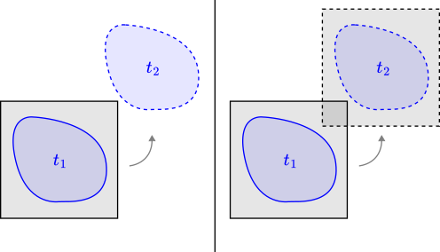
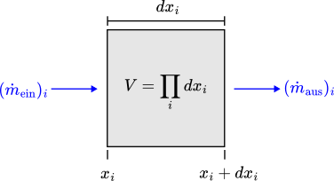
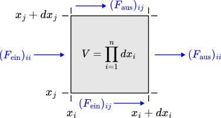

# Teil 1: Physikalische Grundlagen

...

[TOC]

<!------------------------------------------------------------------------------
Vorbetrachtungen
------------------------------------------------------------------------------->
## Vorbetrachtungen

Die Formulierung der Gleichungen stützt sich auf der Kontinuumshypothese. Demnach befinden sich in einem hinreichend kleinen Fluidvolumen ausreichend viele Moleküle, sodass von einem Kontinuum ausgegangen werden kann. Etwas genauer lässt sich die Bedingung mit der Knudsen-Zahl $\mathrm{Kn}$ definieren, welche das Verhältnis der mittleren freien molekularen Weglänge $l$ zur charakteristischen Länge des Strömungsfeldes $L$ (z. B. dem Durchmesser eines durchströmten Rohres) beschreibt.

$$
    \mathrm{Kn} = \frac{l}{L}
$$

Für eine Kontinuumsströmung darf die Knudsen-Zahl nicht größer als ein Hundertstel sein.

> **Tabelle (Strömungsart nach Knudsen-Zahl)**
>
> 

Außerdem lässt sich eine Fluidströmung auf zwei unterschiedliche Weisen betrachten. Einerseits gibt es die Euler'sche Betrachtungsweise, bei der das Koordinatensystem ortsfest ist, und andererseits die Lagrange'sche Betrachtungsweise, bei der das Koordinatensystem mit der Strömung eines einzelnen Fluidpartikels mitgeführt wird, wobei dessen Hülle zwar beliebig flexibel, aber dennoch undurchlässig ist. Nach dem klassischen Relativitätsprinzip kann man sich davon überzeugen, dass sich beide Betrachtungsweisen sowohl mathematisch, als auch physikalisch ineinander überführen lassen. In der folgenden Abbildung ist die zeitliche Entwicklung des Bezugssystems in schwarz und die des Fluidpartikels in blau angedeutet.

> **Abbildung (Euler'sche und Lagrange'sche Betrachtungsweise)**
>
> 

**Anmerkung:** Da die Euler'sche Betrachtungsweise (links im Bild) unserer äußeren Perspektive entspricht, ist sie womöglich etwas intuitiver als die Lagrange'sche. Darum wird im Folgenden auf diese Weise formuliert. Um von der Lagrange'schen zur Euler'schen Betrachtungsweise zu wechsel muss ggf. die sog. substantielle Ableitung berechnet werden, was in diesem Zusammenhang einfach die totale Ableitung meint (der Name illustriert lediglich den Zusammenhang zum Bezugssystem des Fluidpartikels). Für die folgenden Betrachtungen sei außerdem noch erwähnt, dass der Geschwindigkeitsvektor in der numerischen Strömungsmechanik, wie auch hier, üblicher Weise mit $\mathbf{u}$ bezeichnet wird.

<!------------------------------------------------------------------------------
Massenerhaltung (alias Kontinuitätsgleichung)
------------------------------------------------------------------------------->
## Massenerhaltung (alias Kontinuitätsgleichung)

Für die Herleitung der Massenerhaltungsgleichung wird von einem infinitesimalen ortsfesten Kontrollvolumen $V$ ausgegangen. Dafür wird zunächst der Massenstrom über die einzelnen Raumachsen $1$ bis $n$ bilanziert und anschließend aufsummiert, da es sich bei der Masse um eine skalare Größe handelt. Die eingeströmte Seite ist dabei diejenige, deren Flächennormale der positiven Achsenrichtung entgegenzeigt und die ausgeströmte Seite ist dementsprechend diejenige, deren Flächennormale in positive Achsenrichtung zeigt. Da der Massenstrom positiv ist, wenn dem Kontrollvolumen Masse zugeführt wird, geht der austretende Massenstrom mit negativem Vorzeichen in die Bilanz ein. Sollte sich der Massenstrom im Inneren des Kontrollvolumens (z. B. durch chemische Prozesse) ändern, dann muss außerdem noch ein Quellterm berücksichtigt werden. Quellen werden darin mit einem positiven Vorzeichen vermerkt und Senken mit einem negativen.

$$
    \partial_t m = \partial_t (\rho V) = \left[ \sum_{i=1}^n (\dot m_{\mathrm{ein}} - \dot m_{\mathrm{aus}})_i \right] + \dot m_{\mathrm{quell}} = \dot m
$$

> **Abbildung (Massenstrombilanz)**
>
> 

Der eintretende Massenstrom ergibt sich durch Multiplikation der Eintrittsfläche mit der senkrecht zu ihr stehenden Geschwindigkeitskomponente und der entsprechenden Fluiddichte.

$$
    (\dot m_{\mathrm{ein}})_i = \rho u_i V/dx_i
$$

Der austretende Massenstrom ergibt sich wiederum durch die Taylorreihe des eintretenden Massenstroms, entwickelt an der Eintrittsstelle und ausgewertet an der Austrittstelle.

$$
    (\dot m_{\mathrm{aus}})_i = [\rho u_i /dx_i + \partial_{x_i}(\rho u_i) + \mathcal{O}(dx_i)] V
$$

Der Quellterm soll für hiesige Zwecke ignoriert werden.

$$
    \dot m_{\mathrm{quell}} = 0
$$

All diese Terme lassen sich nun in der Bilanzgleichung für den Massenstrom zusammenfassen.

$$
    \partial_t(\rho V) = -\sum_{i=1}^n [\partial_{x_i}(\rho u_i) + \mathcal{O}(dx_i)] V
$$

Da das Kontrollvolumen nach der Euler'schen Betrachtungsweise nicht von der Zeit abhängt, kann es aus der Gleichung rausgekürzt werden. Unter der Annahme, dass das Kontrollvolumen mit seiner Infinitesimalität gleichmäßig auf einen Punkt zusammenschrumpft

$$
    \forall i \in \{ 1,\ldots,n \}\colon~ \lim_{V\to 0} dx_i = 0
$$

entfallen glücklicher Weise die Terme höherer Ordnung.

$$
    \lim_{V\to 0} \partial_t \rho = -\sum_{i=1}^n \partial_{x_i}(\rho u_i)
$$

Übrig bleibt die Kontinuitätsgleichung in ihrer vollen Pracht

$$
    \partial_t \rho + \nabla\cdot (\rho \mathbf{u}) = 0,
$$

oder unter der Annahme von Inkompressibilität (wobei sich das Kontrollvolumen nicht mit dem Druck $p$ ändert und die Dichte $\rho$ konstant bleibt), d. h. in diesem Fall

$$
    \partial_p V = 0 ~\Leftrightarrow~ \rho = \mathrm{konstant}
$$

und somit

$$
    \nabla\cdot \mathbf{u} = 0.
$$

<!------------------------------------------------------------------------------
Impulserhaltung (alias Navier-Stokes-Gleichung)
------------------------------------------------------------------------------->
## Impulserhaltung (alias Navier-Stokes-Gleichung)

Die Herleitung der Impulserhaltungsgleichung erfolgt analog. Somit wird hier der Impulsstrom bilanziert, was nach dem 2. Newton'schen Gesetz der Kraft entspricht. Im Gegensatz zur Masse, versteht sich der Impuls jedoch als vektorielle Größe, sodass ein Gleichungssystem von der Dimension des Raumes entsteht. Außerdem ist zu beachten, dass die Definition der Kraft nach Isaac Newton der Lagrange'schen Betrachtungsweise entspricht und die Geschwindigkeit einer Punktmasse zunächst substantiell abgeleitet werden muss, damit die Kraft im Euler'schen Sinne überhaupt bilanziert werden kann. Ein- und ausströmende Kräfte sind i. d. R. Oberflächenkräfte, wohingegen Volumenkräfte wie die Schwerkraft in einem Quellterm subsumiert werden.

$$
    \mathbf{F} = m \mathbf{a} = (\rho V) (D_t \mathbf{u}) = \left[ \mathbf{F}_\mathrm{ein} - \mathbf{F}_\mathrm{aus} \right] + \mathbf{F}_\mathrm{quell}
$$

> **Abbildung (Kraftbilanz)**
>
> 

Bei den Oberflächenkräfte wird in Druck- und Spannungskräfte unterschieden. Die Druckkräfte wirken zentrisch auf das Kontrollvolumen und werden somit positiv bilanziert. Die Spannungskräfte hingegen wirken exzentrisch und werden demnach negativ bilanziert. Außerdem greifen die Spannungskräfte von allen Seiten an, wodurch die Gleichung erheblich an Komplexität gewinnt. Unter Berücksichtigung dessen lassen sich die eintretenden Kräfte wie folgt zusammenfassen.

$$
\begin{align*}
    (F_\mathrm{ein})_i &= \sum_{j=1}^n (F_\mathrm{ein})_{ij} \\
    &= \underbrace{pV/dx_i}_\mathrm{Druckkräfte} - \underbrace{\sum_{j=1}^n \tau_{ij}V/dx_j}_\mathrm{Spannungskräfte}
\end{align*}
$$

Für die austretenden Kräfte müssen die einzelnen Terme, wie zuvor bei dem austretenden Massenstrom, entlang der negativen Normalenrichtung ihrer Bezugsflächen mit einer Taylor-Reihe entwickelt werden.

$$
\begin{align*}
    (F_\mathrm{aus})_i &= \sum_{j=1}^n (F_\mathrm{aus})_{ij} \\
    &= [p/dx_i + \partial_{x_i}p + \mathcal{O}(dx_i)] V \\
    &\qquad - \sum_{j=1}^n [\tau_{ij}/dx_j + \partial_{x_j}\tau_{ij} + \mathcal{O}(dx_j)] V
\end{align*}
$$

Als Volumenkraft soll hier alleinig die Schwerkraft berücksichtigt werden.

$$
    (F_\mathrm{quell})_i = m g_i
$$

Alles zusammen kann nun in die Bilanzgleichung eingesetzt werden.

$$
    (\rho V) (D_t u_i) = - [\partial_{x_i}p + \mathcal{O}(dx_i)] V + \left\{ \sum_{j=1}^n [\partial_{x_j}\tau_{ij} + \mathcal{O}(dx_j)] V \right\} + (\rho V) g_i
$$

Anschließend wird durch die Masse geteilt. Die Terme höherer Ordnung verschwinden dann wiederum aufgrund der isotropen Infinitesimalität des Kontrollvolumens.

$$
    D_t u_i = - (\partial_{x_i}p)/\rho + \left( \sum_{j=1}^n \partial_{x_j}\tau_{ij} \right)/\rho + g_i
$$

Hier begegnet uns eine mögliche Form der Navier-Stokes-Gleichung.

$$
    D_t \mathbf{u} = -\frac{1}{\rho}\nabla{p} + \frac{1}{\rho}\nabla\cdot\boldsymbol{\tau} + \mathbf{g}
$$

Um diese Gleichung für inkompressibile Fluide zu vereinfachen, kann der Stokes'sche Spannungsansatz

$$
    \boldsymbol{\tau} = \mu [ \nabla\mathbf{u} + (\nabla\mathbf{u})^\top ]
$$

mit den folgenden Identitäten herangezogen werden.

$$
\begin{align*}
    \nabla\cdot (\nabla\mathbf{u}) &= \nabla^2 \mathbf{u} \\
    \nabla\cdot (\nabla\mathbf{u})^\top &= \nabla(\nabla\cdot\mathbf{u}) \\
    \nabla\cdot\mathbf{u} &= 0 \\
    \mu &= \nu\rho
\end{align*}
$$

Wird dies in die Navier-Stokes-Gleichung eingesetzt, so ergibt sich

$$
    D_t \mathbf{u} = -\frac{1}{\rho}\nabla{p} + \nu\nabla^2\mathbf{u} + \mathbf{g}
$$

und mit der substantiellen Ableitung

$$
\begin{align*}
    D_t\mathbf{u} &= (\partial_t{t})(\partial_t\mathbf{u}) + \sum_{i=1}^n \underbrace{(\partial_t x_i)}_{u_i}(\partial_{x_i}\mathbf{u}) \\
    &= \partial_t\mathbf{u} + \left( \sum_{i=1}^n u_i \partial_{x_i} \right) \mathbf{u} \\
    &= \partial_t\mathbf{u} + (\mathbf{u}\cdot\nabla)\mathbf{u}
\end{align*}
$$

letztendlich

$$
    \partial_t\mathbf{u} + (\mathbf{u}\cdot\nabla)\mathbf{u} = -\frac{1}{\rho}\nabla{p} + \nu\nabla^2\mathbf{u} + \mathbf{g}.
$$
