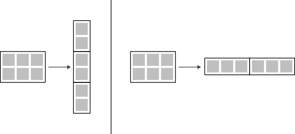

# Teil 2: Numerische Methodik

...

[TOC]

<!------------------------------------------------------------------------------
Räumliche Diskretisierung
------------------------------------------------------------------------------->
## Räumliche Diskretisierung

Um ein zweidimensionales Gitter zu erstellen, werden zunächst die beiden Achsen einzeln diskretisiert und anschließend zu einer gemeinsamen Produktmenge verknüpft. Diese Produktmenge liegt dann als indizierbare Matrix vor. Die Reihenfolge der Achsen kann dabei prinzipiell beliebig festgelegt werden. Allerdings gibt es im Zweidimensionalen eine etwas sonderbare Konvention: Denn es wird zuerst die y-Achse und dann die x-Achse indiziert – also nicht chronologisch, wie es vielleicht zu vermuten wäre. Der Grund dafür ist, dass man sich die so entstehende Matrix in einem Koordinatensystem vorstellt.

$$
    \Omega \coloneqq Y \times X = \{(y,x) ~|~ y\in Y, x\in X\}
$$

> **Begleitmaterial (2d Gitter)**
>
>  
>
> 

<!------------------------------------------------------------------------------
Vektorisierung des Rechengitters
------------------------------------------------------------------------------->
## Vektorisierung des Rechengitters

Auf dem erstellten Gitter werden die strömungsmechanischen Gleichungen numerisch gelöst. Dies geschieht für gewöhnlich in Vektorform, damit sich die Rechenoperationen über Matrizen abwickeln lassen. Dafür müssen die auf dem Gitter abgespeicherten Werte dahingehend überführt werden. Je nachdem werden entweder die Spalten oder Zeilen verkettet.

> **Begleitmaterial (Vektorisierung)**
>
>  
>
> 

<!------------------------------------------------------------------------------
Behandlung dünnbesetzter Matrizen
------------------------------------------------------------------------------->
## Behandlung dünnbesetzter Matrizen

Nach der Vektorisierung eines ($n \times m$)-Gitters werden dessen Werte über ($nm \times nm$)-Matrizen abgebildet. Diese Matrizen sind also sehr Groß und i. d. R. dünnbesetzt. Um die Laufzeit des Lösungsalgorithmus zu verbessern, macht es durchaus Sinn, freie Speicherstellen auszunutzen. Standardbibliotheken stellen dafür spezielle Datenstrukturen bereit.

<!------------------------------------------------------------------------------
Allgemeine Finite-Differenzen-Methode
------------------------------------------------------------------------------->
## Allgemeine Finite-Differenzen-Methode

...

<!------------------------------------------------------------------------------
Erstellung eindimensionaler Ableitungsmatrizen
------------------------------------------------------------------------------->
## Erstellung eindimensionaler Ableitungsmatrizen

...

<!------------------------------------------------------------------------------
Erstellung zweidimensionaler Ableitungsmatrizen
------------------------------------------------------------------------------->
## Erstellung zweidimensionaler Ableitungsmatrizen

...
