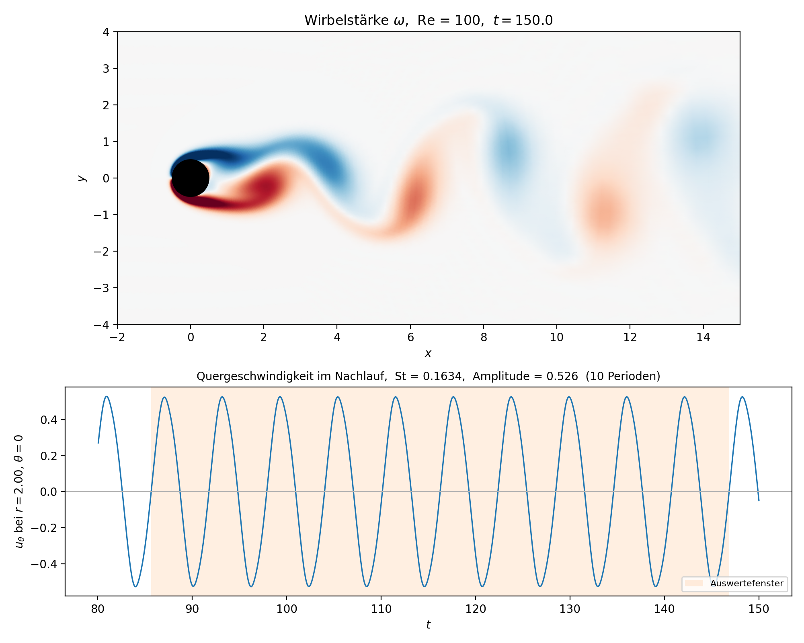
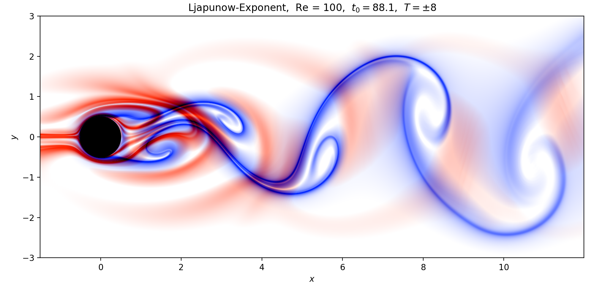

# Wirbelströmung: Zylinderumströmung bei Re = 100

Numerischer Löser für die zweidimensionale, inkompressible Umströmung eines Kreiszylinders.
Gelöst wird die **Wirbeltransportgleichung in der Wirbelstärke-Stromfunktions-Formulierung**
auf einem **logarithmisch-polaren Gitter** mit Finiten Differenzen 2. Ordnung und einem
expliziten **RK4**-Zeitschritt. Bei Re = 100 bildet sich die Kármánsche Wirbelstraße aus.

Studienprojekt zum Kurs *Numerische Methoden*.



Oben die Wirbelstärke der Hauptlösung, unten die Quergeschwindigkeit an einer Sonde im
Nachlauf, aus der die Strouhal-Zahl bestimmt wird.

## Ergebnis in einer Zeile

**St = 0,1634** bei Re = 100 — die Literatur (Williamson 1988) gibt 0,16434, Abweichung **−0,6 %**.

| | Wert |
|---|---|
| Gitter der Hauptlösung | 201 × 320, Fernfeldrand bei 50,3 D |
| Rechenzeit | ≈ 21 min (124 504 Zeitschritte) |
| Strouhal-Zahl | 0,1634 (10 Perioden) |
| Ortskonvergenz | p = 2,34 (Richardson, nominell 2) |
| Ablösewinkel Re = 100 | 116,7° (Literatur ≈ 117°) |

## Schnellstart

Voraussetzungen: Python 3 mit `numpy` (≥ 2.0), `scipy`, `matplotlib`.
Alle Befehle werden im Ordner `Project_docs` ausgeführt.

```bash
cd Project_docs
python main.py schnell     # Funktionstest, wenige Sekunden
```

Für die richtige Rechnung:

```bash
cd Project_docs
python main.py haupt       # Hauptlösung, ca. 21 min
python Animation.py        # Auswertung und Bilder, ca. 25 min
```

`main.py` rechnet die Strömung und legt die Momentaufnahmen in `simulation_snapshots.npz` ab.
`Animation.py` liest diese Datei und erzeugt daraus die Bilder — Simulation und Auswertung
sind bewusst getrennt, damit man die Auswertung wiederholen kann, ohne neu zu rechnen.

> Die Datei `simulation_snapshots.npz` ist rund 600 MB groß und liegt deshalb **nicht** im
> Repository. `python main.py haupt` erzeugt sie. Ohne sie findet `Animation.py` nichts.

### Die Voreinstellungen von `main.py`

| Preset | Gitter | Gebiet | Zeit | Dauer | Zweck |
|---|---|---|---|---|---|
| `schnell` | 50 × 100 | 20 D | t = 0 … 12 | ≈ 1 s | läuft alles durch? |
| **`haupt`** | **201 × 320** | **50,3 D** | **t = 0 … 150** | **≈ 21 min** | **Hauptlösung der Abgabe** |
| `lang` | 160 × 320 | 20 D | t = 0 … 100 | ≈ 15 min | älterer Lauf auf dem kleinen Gebiet |

Ohne Argument entspricht `python main.py` dem Preset `schnell`. Alle drei schreiben in dieselbe
Datei — der Schnelltest überschreibt also eine vorhandene Hauptlösung.

Das Gitter von `haupt` ist genau der feinste Lauf der Konvergenzstudie (Serie `gitter_fern`),
die Hauptlösung steht damit am Ende der eigenen Fehleranalyse. Entscheidend ist dabei weniger
die Gitterweite als das **Rechengebiet**: der Fernfeldrand ist die größte Fehlerquelle, und weil
das Gitter logarithmisch-polar ist, kostet 20 D → 50,3 D nur 40 zusätzliche Radialzeilen.

## Was dabei herauskommt

`Animation.py` schreibt vier Dateien nach `Project_docs/ergebnisse/`:

| Datei | Inhalt |
|---|---|
| `wirbelstaerke.png` | Wirbelstärkefeld und Sondensignal mit Strouhal-Zahl (oben im Bild) |
| `wirbelstaerke.gif` | Animation der Wirbelstraße, 100 Bilder |
| `ftle.png` | Ljapunow-Exponent (FTLE): die Transportbarrieren der Strömung |
| `ftle.gif` | dieselbe Größe über eine volle Ablöseperiode, 30 Bilder |



Rot sind die vorwärts, blau die rückwärts berechneten FTLE-Rippen — die Linien, entlang derer
sich Fluidpakete am stärksten trennen bzw. zusammenlaufen. Sie zeichnen die Wirbelstraße als
geometrische Struktur nach, unabhängig von der Wirbelstärke.

## Validierung

Fünf unabhängige Prüfprogramme sichern den Löser ab. Alle sind **parameterlos** und liefern
den Rückgabewert 0, wenn sie bestanden sind (sonst 1) — sie eignen sich damit direkt für eine
automatische Prüfung. Alle zusammen laufen in unter zwei Sekunden:

```bash
cd Project_docs
python Validierung/selbsttest_alle.py
```

Einzeln aufgerufen:

| Befehl | prüft | Dauer |
|---|---|---|
| `python Validierung/selbsttest_operatoren.py` | die Differenzenmatrizen gegen analytisch abgeleitete Testfunktionen | < 0,1 s |
| `python Validierung/selbsttest_loeser.py` | den Poisson-Löser gegen die Potentialströmung, seine Konvergenzordnung und FFT gegen LR-Zerlegung | 0,6 s |
| `python Validierung/taylor_green.py` | den Taylor-Green-Wirbel: Advektion, Poisson und RK4 **gemeinsam** gegen eine exakte Lösung der nichtlinearen Gleichungen | 0,2 s |
| `python Validierung/mms_logpolar.py` | eine Manufactured Solution auf dem log-polaren Gitter: Metrik samt Vorfaktor 1/r², Advektion, Diffusion und Thom-Formel | 0,1 s |
| `python Validierung/benchmark.py selbsttest` | die Auswertung selbst: Sonde, Periodenfenster, Ablösewinkel und Richardson-Extrapolation | < 0,1 s |

Gemessene Konvergenzordnungen: Poisson-Löser 2,00, Manufactured Solution 2,00 — beides die
nominelle Ordnung des Verfahrens.

## Benchmark-Serien

Die Serien vermessen, wie die Lösung von Auflösung, Zeitschritt, Gebietsgröße und Reynolds-Zahl
abhängt, und vergleichen sie mit der Literatur. Ohne Argument gibt `benchmark.py` nur eine
Übersicht aus und rechnet nichts:

```bash
cd Project_docs
python Validierung/benchmark.py
```

| Serie | variiert |
|---|---|
| `gitter` | Ortsauflösung 41×80 … 161×320 bei festem Gebiet (20 D) |
| `gitter_fern` | dieselbe Verfeinerung auf dem großen Gebiet (50,3 D) — Kreuzprobe zu `gitter` und `gebiet` |
| `gebiet` | Fernfeldrand r_max von 3,2 D bis 126,5 D bei unveränderter Gitterweite |
| `zeit` | `cfl_target` von 0,125 bis 4,0, bis die Rechnung instabil wird |
| `reynolds` | Re von 20 bis 200: vom stationären Wirbelpaar bis zur ausgeprägten Wirbelstraße |
| `alle` | alle fünf nacheinander; Läufe, die in mehreren Serien vorkommen, werden nur einmal gerechnet |

### Optionen

| Option | Bedeutung | Standard |
|---|---|---|
| `--stufe schnell\|mittel\|voll` | Umfang der Serie; jede Stufe enthält alle billigeren mit | `schnell` |
| `--parallel N` | N Läufe gleichzeitig rechnen. Die Zeitmessungen sind dann nicht mehr vergleichbar und werden in der CSV entsprechend markiert | `1` |
| `--neu` | bereits gerechnete Läufe neu rechnen statt sie zu überspringen | aus |
| `--nur-auswerten` | nichts rechnen, nur CSV und Diagramm aus vorhandenen Läufen neu erzeugen | aus |
| `--t-end T` | Endzeit je Lauf | `150` |
| `--ausgabe PFAD` | Zielordner für Läufe, CSV und Diagramme | `Project_docs/ergebnisse/benchmark/` |

Beispiele:

```bash
python Validierung/benchmark.py gitter                      # Serie "gitter", Stufe "schnell"
python Validierung/benchmark.py reynolds --stufe voll       # alle Reynolds-Laeufe
python Validierung/benchmark.py alle --stufe voll --parallel 4
python Validierung/benchmark.py gitter --nur-auswerten      # nur Diagramm neu zeichnen
```

**Gesamtdauer** aller Serien: Stufe `schnell` ≈ 5 min, `mittel` ≈ 13 min, `voll` ≈ 2 h.
Fertige Läufe werden gespeichert und beim nächsten Aufruf übersprungen, ein abgebrochener
Durchlauf lässt sich also einfach fortsetzen.

Alle Serien sind auf der Stufe `voll` **bereits gerechnet**; die Diagramme, Messwerte und
Rohdaten liegen in `Project_docs/ergebnisse/benchmark/`.

## Projektstruktur

```
Project_docs/
  gitter.py               Config, log-polares Gitter, Rechengebiet
  operatoren.py           Differenzenmatrizen und Laplace-Operator
  loeser.py               Randbedingungen, Poisson-Loeser, CFL-Zeitschritt, RK4
  main.py                 Anfangszustand, Zeitschleife, Presets
  signalauswertung.py     Periodenfenster, Strouhal-Zahl, Amplitude
  Animation.py            Auswertung eines Laufs: Wirbelstaerke, St, FTLE
  Validierung/            alle Pruefprogramme und die Benchmark-Serien
  ergebnisse/             Bilder der Hauptloesung und des Benchmarks
```

Rechnender Code und Prüfprogramme sind getrennt: `gitter.py`, `operatoren.py`, `loeser.py` und
`main.py` enthalten nur den Löser, alles Prüfende liegt in `Validierung/` und ruft ihn von außen auf.

## Ausführliche Dokumentation

[**`Project_docs/Validierung/README_Presets.md`**](Project_docs/Validierung/README_Presets.md)
ist die vollständige Referenz zu diesem Projekt und beschreibt im Detail:

- jede einzelne Datei und die Aufrufreihenfolge der Module
- beide Poisson-Löser mit Messwerten, und wann welcher verwendet wird
- alle Presets von `main.py` samt Begründung der Gitterwahl und der Dateigrößen
- **jede Benchmark-Serie mit allen Einzelläufen und deren Laufzeiten je Stufe**
- alle Messgrößen der CSV-Dateien und wie sie bestimmt werden
- die Fehleranalyse: Gitter- gegen Gebietsfehler, Richardson-Extrapolation, Literaturvergleich
- welche Bildeinstellung in `Animation.py` welche Auflösung erzeugt
